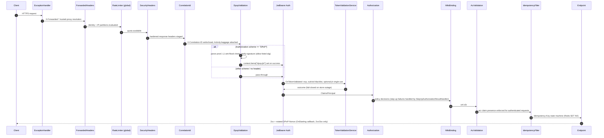
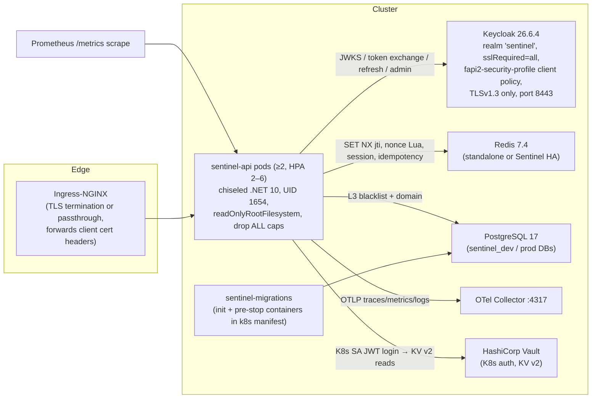

# 02 — Architecture

> Traceability: pipeline order from `samples/Sentinel.Sample.MinimalApi/Program.cs` and `src/Sentinel.AspNetCore/Extensions/SentinelAspNetCoreExtensions.cs`; module roles from `docs/ARCHITECTURE.md` §2 cross-checked against project references; invariants from `src/Sentinel.AspNetCore/Infrastructure/SecurityInvariantsStartupFilter.cs`.

## 1. Architectural Style

Sentinel is a **decoupled hexagonal (ports & adapters)** system (`docs/ARCHITECTURE.md`, Document ID ARC-0001, status APPROVED):

- **Ports** live in `Sentinel.Security.Abstractions` (interfaces, options, result types, exception hierarchy).
- **Protocol engines** (`Sentinel.DPoP`, `Sentinel.SSF`, `Sentinel.Rar`, `Sentinel.SdJwt`, `Sentinel.Session`) are stateless libraries that depend only on ports.
- **Adapters** (`Sentinel.Redis`, `Sentinel.EntityFrameworkCore`, `Sentinel.Keycloak`, `Sentinel.Providers.Vault`, `Sentinel.Infrastructure`) implement ports against concrete technology.
- The **host** (composition root) chooses which adapters are activated. Per `docs/ARCHITECTURE.md` §2.2 (ADR-2026-002 reference), `Sentinel.Infrastructure` no longer references adapter assemblies; Redis/EF activation happens exclusively in the host.

This is enforced mechanically, not just by convention: `tests/Sentinel.Tests.Security/Architecture/ArchitectureTests.cs` (ArchUnitNET) runs in CI.

## 2. Request Pipeline (verified order)

The reference host builds the pipeline exactly as follows (`samples/Sentinel.Sample.MinimalApi/Program.cs`):

```text
1.  UseExceptionHandler            → RFC 7807 problem+json fallback (/errors/internal, traceId extension)
2.  UseForwardedHeaders            → X-Forwarded-For / X-Forwarded-Proto, ForwardLimit=2,
                                      KnownIPNetworks from Sentinel:Mtls:TrustedProxies (defaults cleared first)
3.  UseHttpsRedirection
4.  UseCors                        → only when Cors:AllowedOrigins configured
5.  UseRateLimiter                 → global chained dual-partition limiter (see §5)
6.  UseSentinelPreAuthenticationSecurity
      6a. SecurityHeadersMiddleware
      6b. CorrelationIdMiddleware
      6c. DpopValidationMiddleware
7.  UseAuthentication              → JwtBearer (Keycloak authority; OnTokenValidated → TokenValidationService)
8.  UseAuthorization               → policies + StepUpAuthorizationResultHandler (IAuthorizationMiddlewareResultHandler)
9.  UseSentinelPostAuthenticationSecurity
      9a. MtlsBindingMiddleware
      9b. AcrValidationMiddleware
10. Endpoint execution             → endpoint filters (IdempotencyFilter, AcrStepUpAuthorizationFilter,
                                      SurgicalAuthorizationFilter) run inside the endpoint
11. Terminal: MapOpenApi, MapPrometheusScrapingEndpoint (/metrics), MapScalarApiReference (/docs)
```

The pre/post split is defined in `SentinelAspNetCoreExtensions`:

- `UseSentinelPreAuthenticationSecurity()` registers **SecurityHeaders → CorrelationId → DpopValidation** and its doc-comment states the rationale: these "MUST run before authentication" so correlation-id baggage is attached before token validation and security events (e.g. `TOKEN_REPLAY_ALERT`) are emitted.
- `UseSentinelPostAuthenticationSecurity()` registers **MtlsBinding → AcrValidation**, which "depend on an authenticated principal and MUST run after `UseAuthentication()`".
- A combined `UseSentinelSecurityPipeline()` (all five in order) also exists for hosts without a split pipeline.



## 3. Middleware Responsibilities (implementation-level)

### 3.1 SecurityHeadersMiddleware (`src/Sentinel.AspNetCore/Middleware/SecurityHeadersMiddleware.cs`)

Emits on **every** response:

| Header | Value |
|---|---|
| `Strict-Transport-Security` | `max-age=63072000; includeSubDomains; preload` |
| `Content-Security-Policy` | `default-src 'none'; frame-ancestors 'none'` (default) |
| `X-Content-Type-Options` | `nosniff` |
| `X-Frame-Options` | `DENY` |
| `Referrer-Policy` | `no-referrer` |
| `Permissions-Policy` | `geolocation=(), microphone=(), camera=()` |
| `Cache-Control` | `no-store` |
| `Pragma` | `no-cache` |

It also **removes** `Server` and `X-Powered-By`. A permissive CSP variant (`ScalarCsp`, allowing `cdn.jsdelivr.net`, `'unsafe-inline'`, `'unsafe-eval'`) is applied **only** when `env.IsDevelopment() && path starts with /scalar` — i.e., the Scalar UI in development.

### 3.2 CorrelationIdMiddleware

Reads or generates `X-Correlation-ID` (falls back to `Activity.Current.TraceId`, then `Guid.NewGuid("N")`), echoes it on the response, and attaches Activity baggage keys `correlationId` and (when present) `dpop.jkt` for downstream correlation (SQL audit, messaging). Wraps the downstream call in a logging scope containing `CorrelationId` and `DPoPKey`.

### 3.3 DpopValidationMiddleware

Full behavioral specification in [03-SECURITY-AND-CRYPTOGRAPHY.md §3](./03-SECURITY-AND-CRYPTOGRAPHY.md). Architecturally relevant properties:

- **Activation predicate**: only when `Authorization` starts with scheme `DPoP ` (case-insensitive). Bearer-only requests pass through to authentication; the *downgrade* risk is covered by `MtlsBindingMiddleware`'s DPoP-bound-token check (§3.5) and by the DAST template `infra/dast/nuclei/templates/sentinel-dpop-bearer-downgrade.yaml`.
- **Fail-closed infrastructure semantics**: any `SecurityInfrastructureException` bubbling from nonce/replay stores is caught at the middleware boundary and converted to **HTTP 503** with `Retry-After: 5` and problem type `/errors/service-unavailable` (log event 2003 `DpopInfrastructureUnavailable`). The bridge extension `DpopNonceStoreExtensions` explicitly documents that infrastructure exceptions are *not* swallowed so an outage cannot be misreported as a client-side 401.
- **Constant-time failure padding**: every failure path routes through `EnforceConstantTimeFailureAsync`, which pads elapsed time to `TargetFailureFloorMs = 120 ms` plus cryptographic jitter `RandomNumberGenerator.GetInt32(0, 16)` ms.
- **L1 anti-flood**: before doing expensive crypto, the middleware consults `L1AntiFloodCache` keyed by JWK thumbprint; failures feed it back (see §3.7).

### 3.4 JwtBearer authentication (host-configured)

Configured in the sample host (`Program.cs`):

- `MapInboundClaims = false` (raw JWT claim names preserved).
- `ValidAlgorithms = ["PS256", "ES256"]`; `ValidateIssuer/Audience/Lifetime/IssuerSigningKey = true`; **`ClockSkew = TimeSpan.Zero` in production** (60 s only under Development).
- `OnMessageReceived` strips the `DPoP ` scheme prefix so DPoP-scheme requests authenticate with the embedded access token.
- `OnTokenValidated` re-materializes `exp`, `sid`, `sub`, `acr`, `scope` claims onto the identity, then delegates to `TokenValidationService.ValidateAsync` (expiry re-check, subject+session blacklist, optional jti single-use enforcement — see [03 §6](./03-SECURITY-AND-CRYPTOGRAPHY.md)).
- `OnChallenge` returns `401` + `WWW-Authenticate: Bearer error="invalid_token", error_description="Authentication required"` + problem type `/errors/unauthorized`; the detail string is sanitized with `Regex.Replace(detailedError, @"[\r\n\t\x00-\x1F\x7F]", "")` (header/response-splitting and control-character scrubbing).
- `OnAuthenticationFailed` counts `SecurityTokenSignatureKeyNotFoundException` as JWKS kid-miss telemetry (`crypto.jwks.kid_miss_total`, `crypto.jwks.refresh_total`).
- Backchannel: shared `SocketsHttpHandler` pinned to **TLS 1.3** (`EnabledSslProtocols = SslProtocols.Tls13`), `PooledConnectionLifetime = 2 min`, custom root-trust chain when `Security:TrustedRootCaPath` is configured, online revocation checking outside Development.

### 3.5 MtlsBindingMiddleware (RFC 8705)

- Skips unauthenticated requests.
- **DPoP-bound tokens** (`cnf` containing `jkt` and *no* `x5t#S256`): pass only if the DPoP middleware recorded `context.Items["dpop.jkt"]`; otherwise **401** with `WWW-Authenticate: DPoP error="invalid_dpop_proof"` and problem type `/errors/dpop-binding-required`. This closes the "DPoP token presented as Bearer" downgrade.
- **mTLS-bound tokens**: expected thumbprint extracted *exclusively* from the authenticated principal's `cnf.x5t#S256` claim (never from request data); missing `cnf` ⇒ **fail-closed 403** ("Scenario 10 Fail-Closed" comment).
- Certificate acquisition: from trusted-proxy headers (`Sentinel:Mtls:TrustedProxies` CIDR match via `IPNetworkMatcher`; header list `X-Client-Cert`, `X-SSL-Client-Cert`, `X-ARR-ClientCert`, `X-Amzn-Mtls-Client-Cert`; multi-valued header ⇒ reject; `%`-encoded values URL-unescaped) **or** direct `Connection.GetClientCertificateAsync()` when `AllowDirectConnection=true`; direct connections rejected when it is false.
- Comparison: `SHA256(cert.RawData)` base64url vs `cnf.x5t#S256` using `CryptographicOperations.FixedTimeEquals` on stack-allocated buffers (length-capped at 128 bytes).
- Optional chain validation (`ValidateChain`, default `true`): `X509Chain` with `RevocationMode=Offline`, `RevocationFlag=ExcludeRoot`, application policy EKU **clientAuth (1.3.6.1.5.5.7.3.2)**, 2 s URL retrieval timeout.
- Results cached in `MtlsCertificateCache` for 5 minutes (`mtls:` and `mtls-valid:` key spaces).
- All rejections: **403** problem type `/errors/mtls-binding-failed` (log events 3001 `MtlsWarning`, 3002 `MtlsProxyError`, 3003 `MtlsCryptoError`).

### 3.6 AcrValidationMiddleware + step-up machinery

- `AcrValidationMiddleware`: any authenticated principal **must** carry a non-empty `acr` claim, else **401** problem type `/errors/invalid_token` ("Authenticated token must include acr claim.").
- `AcrAuthorizationHandler` (policy level): rank comparison from `AcrRankingOptions.Rankings` (default `acr1=1, acr2=2, acr3=3`); user rank ≥ required rank ⇒ succeed; explicit `context.Fail(...)` otherwise; unknown ACR values fail by not succeeding.
- `AcrStepUpAuthorizationFilter` (endpoint level, applied via `.RequireAcrStepUp("acr3", TimeSpan.FromMinutes(5))`): exact-ACR match + `auth_time` recency (NIST SP 800-63B rationale in doc-comment); failures emit `WWW-Authenticate: Bearer error="insufficient_user_authentication", ..., acr_values="acr3", max_age="300"` and problem types `/errors/insufficient-acr` or `/errors/session-too-old` with `required_acr`/`max_age` extensions.
- `StepUpAuthorizationResultHandler` is registered as `IAuthorizationMiddlewareResultHandler` by `ConfigureAcrRanking()` so authorization failures can produce step-up challenges instead of a bare 403.
- **Framework policies** (`AddApplicationLayer(configuration)` in `src/Sentinel.Application/DependencyInjection/ApplicationServiceCollectionExtensions.cs`):
  - *Default policy* (applies to every bare `RequireAuthorization()`): `RequireAuthenticatedUser()` **+ `RequireClaim("acr")`** — an authenticated token without `acr` can never pass authorization.
  - `RequireAcr3` ("Policies.RequireAcr3"): authenticated + `AcrRequirement("acr3")`.
  - `ElevatedAccess`: authenticated + `AcrRequirement("acr3")` + assertion that claim `security_clearance` ∈ {`top-secret`, `classified`} (Zero-Trust, configuration-driven per the `SecurityLevelOptions` doc-comment).
  - Handlers registered: `ScopeAuthorizationHandler`, `AcrAuthorizationHandler`, `UmaResourceAuthorizationHandler` (UMA 2.0 permission checks via `IUmaPermissionService`); `SecurityLevelOptions` and `AcrRankingOptions` bound from configuration.

### 3.7 L1AntiFloodCache (`src/Sentinel.AspNetCore/Stores/L1AntiFloodCache.cs`)

In-memory first line of defense against L7 DoS targeting Redis:

- Registered as singleton with **TTL = 3 s** (`AddDPoPValidation()` wiring: `new L1AntiFloodCache(timeProvider, TimeSpan.FromSeconds(3))`).
- Capacity hard-capped at **50 000** entries; lock-free chronological pruning (`ConcurrentQueue` expiry index) with **FIFO eviction fallback** and full-clear last resort to guarantee write availability and strict memory bounds.
- DPoP middleware flow: blacklisted thumbprint ⇒ immediate constant-time 401 (`l1_anti_flood_blocked` telemetry reason); every signature/validation failure ⇒ `RecordFailedAttempt(thumbprint)`.

## 4. Composition & Registration Surface

`AddSentinelAspNetCore()` (`SentinelAspNetCoreExtensions`) performs:

1. `AddMemoryCache()`.
2. Registers `SecurityInvariantsStartupFilter` as an idempotent `IStartupFilter` (`TryAddEnumerable`) — comment: "G4: production guardrails are now enforced, not merely documented."
3. JSON hardening: `JavaScriptEncoder.Default` (strict HTML escaping — comment "G-XSS" notes .NET 10 Minimal APIs do **not** escape by default) and inserts `AspNetCoreJsonContext.Default` at position 0 of the `TypeInfoResolverChain` for both Minimal-API and MVC `JsonOptions`.

The fluent builder (`SentinelAspNetCoreBuilder`) exposes `AddDPoPValidation()`, `AddMtlsBinding()`, `AddIdempotencyFilters()`, `AddAll()`, `ConfigureAcrRanking()`; each is idempotent via `Interlocked.Exchange` guards. `AddDPoPValidation()` binds `DPoPOptions` from section `DPoP`, deduplicates `AllowedAlgorithms`, and installs a **startup validator** restricting configured algorithms to the global allow-list `{PS256, ES256, EdDSA, ML-DSA-44, ML-DSA-65, ML-DSA-87}` with the failure message: *"CRITICAL SECURITY INVARIANT VIOLATED: Configured DPoP algorithms must be restricted only to secure FAPI 2.0 Baseline/Advanced or FIPS 204 PQC profiles (PS256, ES256, EdDSA, ML-DSA). Weak algorithms (RS256, HS256, none) are strictly prohibited."* It also registers `TimeProvider.System` and the 3-second `L1AntiFloodCache`. `AddIdempotencyFilters()` does `TryAddSingleton<IIdempotencyStore, InMemoryIdempotencyStore>()` — deliberately *TryAdd*, so a host that registered `RedisIdempotencyStore` first wins; the startup filter (§6) rejects the in-memory store outside Development.

Adapter activation (host): `AddRedisSecurityCaches(builder.Configuration.GetSection("Sentinel:Redis"))` registers `RedisOptions` (+ `IValidateOptions<RedisOptions>` → `RedisOptionsValidator`), `IRedisConnectionProvider`, `IJtiReplayCache` → `RedisJtiReplayCache`, `IDpopNonceStore` → `RedisDpopNonceStore`, `ISessionBlacklistCache` → `RedisSessionBlacklistCache`, `IIdempotencyStore` → `RedisIdempotencyStore`, and `IEmailVerificationTokenStore` (`TryAddSingleton`) — all singletons (`src/Sentinel.Redis/Extensions/RedisServiceExtensions.cs`).

## 5. Rate Limiting Architecture (reference host)

Global limiter = `PartitionedRateLimiter.CreateChained(primaryQuota, networkFloor)` — **both** partitions must have quota:

| Partition | Key | Algorithm | Limits |
|---|---|---|---|
| Primary (identity) | `sub:{sub}` extracted from the DPoP/Bearer JWT when parseable; otherwise `ip:{remoteIp}`; otherwise `ip:anonymous` | Sliding window | `PermitLimit=20`, `Window=10s`, `SegmentsPerWindow=2`, `QueueLimit=5`, `OldestFirst` |
| Network floor (IP) | `Connection.RemoteIpAddress` (or `anonymous-ip`) | Sliding window | `PermitLimit=100`, `Window=10s`, `SegmentsPerWindow=2`, `QueueLimit=2`, `OldestFirst` |

Rejection: `429`, `Retry-After: 10`, problem type `/errors/rate-limit-exceeded` (both `RejectionStatusCode` and the `OnRejected` handler). Bypass attempts are covered by `tests/Sentinel.Tests.Security/Security/RateLimitingBypassAttemptsTests.cs`.

## 6. Startup Security Invariants (fail-fast guardrails)

`SecurityInvariantsStartupFilter` (`src/Sentinel.AspNetCore/Infrastructure/SecurityInvariantsStartupFilter.cs`) runs on every non-Development environment and throws `InvalidOperationException` (process refuses to start) when:

1. `RedisOptions` validation fails (validator present) — *"CRITICAL CONFIGURATION ERROR"*.
2. `IIdempotencyStore` is missing or is `InMemoryIdempotencyStore` — *"…Staging, UAT, and Production environments MUST use a distributed, transaction-safe database provider (Redis) to prevent Split-Brain / Double-Spending."*
3. `IDpopNonceStore` implementation type name starts with `Ef` — EF-backed nonce store forbidden in production ("High-frequency single-use nonces cause fatal database disk I/O bottlenecks and index bloat. Use RedisDpopNonceStore.").
4. `IJtiReplayCache` implementation type name starts with `Ef` — EF-backed replay cache forbidden in production ("…must use Redis to prevent database locks and latency spikes").

Additional fail-fast validators:

- `SessionManagementOptionsValidator` (`src/Sentinel.Session/SessionManagementOptions.cs`): rejects non-positive `SessionMaxLifetime` / `BlacklistCleanupInterval`.
- `AcrRankingOptions.Validate()`: rejects empty rankings and duplicate rank values.
- `DpopProofValidator` constructor: throws `CryptographicException` if `AllowedAlgorithms` is empty ("FAPI 2.0 violation") or contains any algorithm outside the global allow-list ("FAPI 2.0 violation: Prohibited algorithm '{alg}' found in configuration.").
- `RedisOptionsValidator`: rejects empty endpoint, `://` in endpoint, control/whitespace/`*` characters, non-positive timeouts, empty `KeyPrefix`, and malformed Sentinel `ServiceName`.

## 7. Persistence Architecture

Two DbContexts, separated by concern:

| Context | Assembly | Migration | Purpose |
|---|---|---|---|
| `SentinelDbContext` | `Sentinel.Infrastructure/Persistence` | `20260720210244_InitialDomainDb` | Domain persistence |
| `SentinelSecurityDbContext` | `Sentinel.EntityFrameworkCore` | `20260726212544_InitialSecurityDb` | Security caches: DPoP nonce entries, JTI replay entries, session blacklist entries (`Models/SecurityCacheEntities.cs`) |

- EF stores (`EfDpopNonceStore`, `EfJtiReplayCache`, `EfSessionBlacklistCache`) implement the same ports as the Redis stores with identical fail-closed exception behavior (`NonceStoreUnavailableException`, etc.), but are **development/low-throughput options only** — production use is blocked by §6.
- `HybridSessionBlacklistCache` (`src/Sentinel.EntityFrameworkCore/Stores/HybridSessionBlacklistCache.cs`) is the tiered design for session revocation:
  - **L1** (node-local MemoryCache): stores *only confirmed revocations* — the class comment marks this a "SECURITY INVARIANT (P0)": L1 never caches a positive "session is active" decision; absence of an L1 entry never means valid.
  - **L2**: any `ISessionBlacklistCache` accelerator (typically Redis), never a concrete Redis type (drop-in replaceable).
  - **L3**: PostgreSQL via `IDbContextFactory<SentinelSecurityDbContext>` (source of truth).
  - Revocations write-through all tiers and are **proactively broadcast** over Redis Pub/Sub to pre-populate other nodes' L1 (missed broadcasts are harmless — L2/L3 still protect).
  - When L2 is unavailable, a strict **1-second degraded-mode marker** (`DegradedActiveTtl = TimeSpan.FromSeconds(1)`) bounds any fail-open window to 1 s and prevents a request storm from collapsing PostgreSQL.
  - Key prefixes keep environments sharing one Redis cluster isolated (comment: "staging: vs prod:").
- `SecurityCacheCleanupService`: `BackgroundService` sweeping expired security-cache rows every **15 minutes** (`CleanupInterval = TimeSpan.FromMinutes(15)`).
- Redis-native TTL semantics: cleanups in the Redis stores are no-ops by design ("Redis automatically expires keys via TTL").

## 8. Kestrel & Transport Hardening (reference host)

From `samples/Sentinel.Sample.MinimalApi/Program.cs`:

| Control | Value |
|---|---|
| `MaxConcurrentConnections` | 10 000 |
| `MaxConcurrentUpgradedConnections` | 10 000 |
| `MaxRequestBodySize` | 10 KiB (`10 * 1024`) |
| `MinRequestBodyDataRate` | 100 bytes/s with 10 s grace |
| `MinResponseDataRate` | 100 bytes/s with 10 s grace |
| `KeepAliveTimeout` | 2 minutes |
| Client certificates (Development) | `ClientCertificateMode.DelayCertificate` |
| Certificate hot-reload | `AddKestrelCertificateReloader`/`UseKestrelCertificateReloader` when `Kestrel:CertificateReloader:Path` exists |

`KestrelCertificateReloader` (`src/Sentinel.AspNetCore/Infrastructure/KestrelCertificateReloader.cs`) watches the configured PEM/PFX file (debounce 500 ms; startup timeout 30 s; `WarningDaysThreshold` 30 days), atomically swaps the served certificate without restart, and publishes remaining lifetime to the observable gauge `crypto.tls.cert_days_remaining` (`AuthTelemetry.TlsCertDaysRemaining`). PFX loads use `X509KeyStorageFlags.MachineKeySet | EphemeralKeySet`.

## 9. Cross-Cutting Design Principles (evidenced in code)

1. **Fail-closed everywhere in the security boundary.** Every store throws a typed `SecurityInfrastructureException` subclass on outage; middleware converts to 503 (+`Retry-After`); `TokenValidationService` returns failure on `ReplayCacheUnavailableException`/`SessionBlacklistUnavailableException`; `SessionManager.RevokeSessionAsync` returns `SecurityResult.Failure("revocation_unavailable")` on any cache error; `DpopProofValidator` defaults to a `FailClosedMlDsaVerifier` (returns `false`) when no PQC verifier is injected; `MlDsaSignatureVerifier` returns `false` on *every* error path including missing platform support.
2. **Constant-time and noise-injected comparisons.** `CryptographicOperations.FixedTimeEquals` for mTLS thumbprints; SHA-256 length normalization + constant-time compare for the `SSF-Auth-Token` header (`SsfEndpoints.IsAuthTokenValid`); 120 ms failure floor + 0–15 ms CSPRNG jitter on DPoP failures; dedicated verification suites (`DpopTimingSideChannelTests`, `TimingAttackTests`).
3. **Allocation discipline on hot paths.** `LoggerMessage.Define` compiled delegates everywhere (event-ID catalog in [08-OPERATIONS-RUNBOOK.md](./08-OPERATIONS-RUNBOOK.md)); `stackalloc`/`ArrayPool` in mTLS and hashing paths; `FrozenDictionary` for the ML-DSA algorithm map; STJ source-generated contexts in every module (`*JsonContext.cs`), enforced by `JsonSerializerIsReflectionEnabledByDefault=false`.
4. **Allow-lists, never deny-lists.** Signature algorithms (global set of six), disclosure hash algorithms (`["sha-256"]`), Kestrel TLS via TLS 1.3-only outbound handler, Keycloak container `KC_HTTPS_PROTOCOLS: TLSv1.3` and `KC_HTTP_ENABLED: "false"` (`docker-compose.yml`).
5. **Defense against resource-exhaustion at the parser boundary.** 8 192-char DPoP header cap; 10 KiB request-body cap; 50 000-entry L1 flood cache; `MaxAuthorizationDetailsCount = 100` for RAR; certificate-header multi-value rejection; exception shielding (`try/catch` typed filters) around all token parsers — the code comments label these "Exception Shielding (DoS Prevention)" (`docs/ARCHITECTURE.md` §4.2).
6. **Privacy by construction in telemetry.** IPs, JTIs, session IDs and user IDs are hashed with a daily-rotating derived key (`PrivacyPreservingHasher`) before logging/emitting; `SecurityContextHasher.HashIp` is the canonical entry point used by `TokenValidationService` replay events.

## 10. Deployment Topology (logical)

From `docker-compose.yml` (local) and `infra/k8s/*` + `infra/helm/sentinel` (cluster):



Kubernetes workload specifics (verified in `infra/k8s/sentinel-api-deployment.yaml` and Helm values): pod security `runAsNonRoot: true`, `runAsUser/Group/fsGroup: 1654`, `readOnlyRootFilesystem: true`, `allowPrivilegeEscalation: false`, `capabilities.drop: [ALL]`, `seccompProfile: RuntimeDefault`; HTTPS on 8080 with cert/key mounted from `sentinel-api-tls`; liveness/readiness `GET /healthz` (HTTPS, 8080); resources 250m/256Mi → 500m/512Mi; secrets injected via `secretKeyRef` from `sentinel-runtime-secrets` (`postgres-connection-string`, `redis-connection-string`, `keycloak-client-secret`); OTLP endpoint `http://otel-collector.observability.svc.cluster.local:4317`; `DOTNET_EnableDiagnostics=0`.
