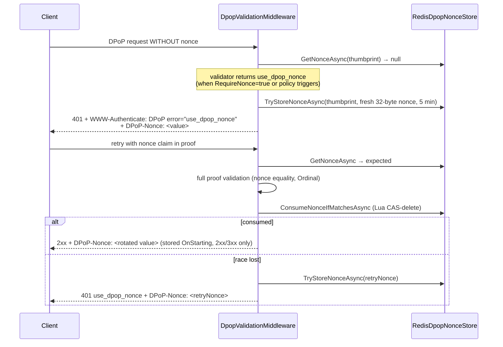
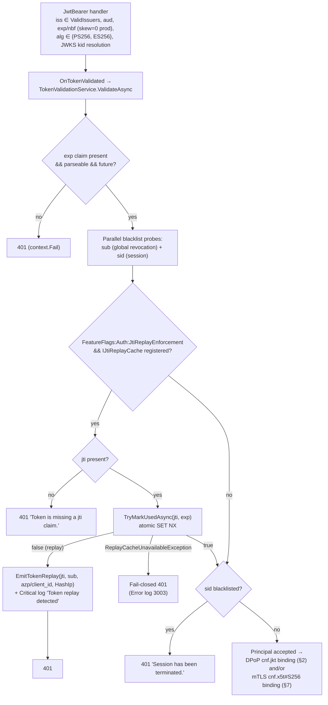

# 03 — Security & Cryptography

> High-assurance cryptographic audit of the Sentinel codebase. Every control below cites its implementing file; every constant is quoted from source. Standards identifiers (RFC/FIPS/NIST numbers) are used exactly as annotated in the repository's own code comments and documentation.

## 1. Algorithm Governance

### 1.1 Global allow-list

Two independent, mutually consistent allow-lists exist and both are enforced at startup **and** at validation time:

```csharp
// Identical set in src/Sentinel.DPoP/DpopProofValidator.cs and
// src/Sentinel.AspNetCore/Extensions/SentinelAspNetCoreExtensions.cs
private static readonly HashSet<string> GloballyAllowedAlgorithms = new(StringComparer.OrdinalIgnoreCase)
{
    "PS256", "ES256", "EdDSA", "ML-DSA-44", "ML-DSA-65", "ML-DSA-87"
};
```

Enforcement layers:

1. **Options validation** (`AddDPoPValidation()`): configured `DPoP:AllowedAlgorithms` must be non-empty and a subset of the global set; `ValidateOnStart()` fails the host otherwise (message quoted in [02 §4](./02-ARCHITECTURE.md)).
2. **Constructor invariant** (`DpopProofValidator` ctor): throws `CryptographicException` — "FAPI 2.0 violation: AllowedAlgorithms list cannot be empty." / "FAPI 2.0 violation: Prohibited algorithm '{alg}' found in configuration."
3. **Per-proof check**: `unsupported_algorithm` unless `token.Alg` ∈ configured subset; the JWK's own `alg` member (if present) must equal the header `alg` (algorithm-confusion defense); `kty`↔`alg` family binding is enforced (`EC`→`ES*`, `RSA`→`PS*`, `OKP`→`EdDSA`, `ML-DSA`→`ML-DSA*`).
4. **Single-algorithm signature validation**: `TokenValidationParameters.ValidAlgorithms = [algorithm]` — the token's own declared algorithm is pinned as the *only* acceptable algorithm for that verification, eliminating alg-substitution inside the handler.
5. **Access tokens**: host JwtBearer pinned to `ValidAlgorithms = ["PS256", "ES256"]` (sample host).
6. **Symmetric-key confusion**: `kty == "oct"` in a DPoP JWK is rejected with a critical log — "Symmetric oct-key confusion attempt detected." (event 2002 `DpopAttackBlocked`); private-key material in the public JWK (`d`, and additionally `k`, `p`, `q` in the validator) is rejected (`private_jwk_rejected` / attack-blocked log).

Weak algorithms (`RS256`, `HS256`, `none`) are structurally impossible to configure. Adversarial coverage: `tests/Sentinel.Tests.Security/Security/AlgorithmResilienceTests.cs`, `CompositeAuthDowngradeTests.cs`, `WeakKeyTests.cs`, `tests/Sentinel.Tests.DPoP/DpopProofValidatorTests.cs`.

### 1.2 Defaults

`DPoPOptions` (`src/Sentinel.Security.Abstractions/Options/DPoPOptions.cs`, section `DPoP`):

| Key | Default | Constraint | Notes |
|---|---|---|---|
| `AllowedClockSkewSeconds` | **10** | `[Range(0, 300)]` | Doc-comment: "Strictly set to 10 seconds default per FAPI 2.0." |
| `ProofLifetimeSeconds` | **60** | `[Range(1, 300)]` | Proofs older than this are rejected |
| `RequireNonce` | **false** | — | When true, every proof must carry the server nonce |
| `AllowedAlgorithms` | **["PS256", "ES256"]** | subset of global allow-list | Sample host extends to `["PS256","ES256","EdDSA","ML-DSA-65"]`; Helm prod values pin `PS256`, `ES256` via env `DPoP__AllowedAlgorithms__0/1` |

## 2. DPoP Proof Validation — Complete State Machine

`DpopProofValidator.ValidateAsync` (`src/Sentinel.DPoP/DpopProofValidator.cs`) executes the following ordered checks. The error column is the exact `SecurityResult` failure string returned (surfaced to clients only through the challenge grammar in §2.3 — never verbatim).

| # | Check | Failure code | Detail |
|---|---|---|---|
| 1 | Request non-null | `invalid_request` | — |
| 2 | Header present, non-blank, `Length ≤ 8192` (`MaxDpopHeaderLength`) | `invalid_dpop_header_size` | DoS bound on parser |
| 3 | `JsonWebTokenHandler.CanReadToken` (3-segment JWS) | `invalid_dpop` | — |
| 4 | `alg` ∈ configured allow-list | `unsupported_algorithm` | case-insensitive |
| 5 | `typ == "dpop+jwt"` | `invalid_typ` | case-insensitive per RFC 9449 |
| 6 | `jwk` header present | `missing_jwk` | — |
| 7 | `jwk.alg` (if present) == header `alg` | `unsupported_algorithm` | confusion defense |
| 8 | `jwk` contains no `d`/`k`/`p`/`q` | `private_jwk_rejected` | private material in public JWK |
| 9 | `jwk.kty` present and family-matched to `alg` | `invalid_jwk` / `unsupported_algorithm` | EC→ES*, RSA→PS*, OKP→EdDSA, ML-DSA→ML-DSA* |
| 10 | ML-DSA: `x` present, base64url-decodable, length ∈ {1312, 1952, 2592} for {44, 65, 87} | `invalid_jwk` | exact FIPS 204 public-key sizes |
| 11 | JWS signature verifies against the embedded public JWK, single pinned algorithm, `RequireSignedTokens=true`, `ValidateIssuerSigningKey=true` | `invalid_signature` | `ValidateLifetime=false` — see note below |
| 12 | `jti` present, non-blank | `missing_jti` | — |
| 13 | `htm` equals actual HTTP method | `htm_mismatch` | case-insensitive ("RFC 9449: case-insensitive matching" comment) |
| 14 | `htu` equals request URI after normalization | `htu_mismatch` | normalization: absolute-URI parse, strip query & fragment, drop default port, trim trailing `/`, then **Ordinal** compare |
| 15 | Nonce policy | `use_dpop_nonce` | see §3 |
| 16 | `iat` present | `missing_iat` | — |
| 17 | `iat ∈ [now − ProofLifetimeSeconds − skew, now + skew]` | `iat_out_of_bounds` | freshness window |
| 18 | RFC 7638 thumbprint computable | `unsupported_key_type` | see §4 |
| 19 | If access token supplied: readable, `cnf.jkt` present & non-blank | `invalid_access_token` / `missing_cnf_jkt` | — |
| 20 | `cnf.jkt` == computed thumbprint | `jkt_mismatch` | Ordinal (base64url is case-significant) |
| 21 | Proof `jti` unused: `TryMarkUsedAsync($"dpop:{jti}", iat + ProofLifetimeSeconds + skew)` | `jti_replay_detected` | atomic SET NX; TTL covers lifetime + skew |
| — | Any `JsonException`/`SecurityTokenException`/`CryptographicException`/`FormatException`/`ArgumentException`/`InvalidOperationException` | `validation_error` | exception shielding |

On success the validator returns a fresh **rotated nonce** (32 CSPRNG bytes, base64url) and the JWK thumbprint (`DpopValidationSuccess(newNonce, thumbprint)`).

> **`ValidateLifetime=false` is correct, not a finding.** Both the validator and the middleware carry explicit comments plus `nosemgrep` suppressions: RFC 9449 proofs carry `iat/jti/htm/htu/nonce` and **no `exp`**; freshness is enforced by check #17 and single-use by check #21. Enabling lifetime validation "would reject every valid proof."

### 2.1 Effective Redis key space

The validator passes `dpop:{jti}` to `IJtiReplayCache`; `RedisJtiReplayCache` composes the physical key as `{RedisOptions.KeyPrefix}jti:{jti}`. With the production prefix `sentinel_prod:` (Helm `values.yaml`), a DPoP proof jti lands at:

```text
sentinel_prod:jti:dpop:<proof-jti>          value "1", TTL = iat + ProofLifetimeSeconds + skew − now (min 1 s)
sentinel_prod:jti:<access-token-jti>        value "1", TTL = remaining lifetime until exp (single-use enforcement)
```

### 2.2 Middleware pre-validation layer

`DpopValidationMiddleware` repeats the cheap structural checks *before* invoking the validator, adding flood protection:

1. Activation only on `Authorization: DPoP <token>` (case-insensitive prefix).
2. Proof readable + `jwk` header + thumbprint computable (`malformed_dpop_proof` otherwise).
3. `L1AntiFloodCache.IsTemporarilyBlacklisted(thumbprint)` → immediate 401 (`l1_anti_flood_blocked`).
4. Signature pre-check (same pinning as the validator) plus `oct`/private-key confusion blocks; failure feeds `RecordFailedAttempt(thumbprint)` (3-s blacklist window).
5. Full `IDpopProofValidator.ValidateAsync` with the expected nonce from the store; failure feeds the anti-flood cache and, for `use_dpop_nonce`, issues a challenge nonce (§3).
6. On success with a stored expected nonce: **atomic consumption** via `ConsumeNonceIfMatchesAsync`; a lost race yields a retry nonce + 401 `use_dpop_nonce` (never a silent pass).
7. `context.Items["dpop.jkt"] = thumbprint` — the *only* signal by which `MtlsBindingMiddleware` accepts a DPoP-bound token presented with the DPoP scheme.
8. Nonce rotation for the *next* request is staged in `Response.OnStarting` and only persisted/emitted when the final status is 2xx–3xx (`StatusCode is < 200 or >= 400` ⇒ skip), preventing nonce churn on failed responses.

### 2.3 Client-visible challenge grammar (exact strings)

401 responses from DPoP enforcement carry `Content-Type: application/problem+json; charset=utf-8`, problem type `/errors/invalid-dpop-proof`, and:

| Condition | `WWW-Authenticate` |
|---|---|
| Nonce required/mismatch | `DPoP error="use_dpop_nonce", algs="PS256 ES256 …"` (space-joined configured algorithms) |
| No/blank `DPoP` header on a DPoP-scheme request | `DPoP error="missing_dpop_proof"` |
| Any other validation failure | `DPoP error="invalid_dpop_proof", algs="PS256 ES256 …"` |
| DPoP-bound token without validated proof (mTLS middleware) | `DPoP error="invalid_dpop_proof"` (problem type `/errors/dpop-binding-required`) |

Infrastructure outage ⇒ **503**, `Retry-After: 5`, problem type `/errors/service-unavailable`, title "Security infrastructure unavailable".

### 2.4 Timing-attack mitigation (quantified)

`EnforceConstantTimeFailureAsync`:

- Records `auth.dpop.failures{reason}` before responding.
- Writes the full 401 body, then computes `target = 120 ms (TargetFailureFloorMs) + RandomNumberGenerator.GetInt32(0, 16) ms`; if elapsed < target, `Task.Delay(remaining)`.
- Result: early syntactic failures and late cryptographic failures are indistinguishable below the floor, and the CSPRNG jitter defeats averaging. `docs/ARCHITECTURE.md` §4.1 records Welch's t-test verification (p > 0.05) with test evidence in `tests/Sentinel.Tests.Security/Security/DpopTimingSideChannelTests.cs` and `TimingAttackTests.cs`.

## 3. DPoP Nonce Management (RFC 9449 challenge–response)

Store contract: `IDpopNonceStore` (`src/Sentinel.Security.Abstractions/Nonce/IDpopNonceStore.cs`) — `GetNonceAsync`, `SetNonceAsync`, `ConsumeNonceIfMatchesAsync`, `CleanupExpiredAsync`.

**Redis implementation** (`RedisDpopNonceStore`), key `{prefix}nonce:{thumbprint}`:

- Consumption is a **Lua compare-and-delete** executed atomically on Redis's single-threaded event loop:

```lua
if redis.call('GET', KEYS[1]) == ARGV[1] then
    redis.call('DEL', KEYS[1])
    return 1
else
    return 0
end
```

- Mismatch/race increments `auth.dpop.nonce_mismatch_total` and logs a warning; outage throws `NonceStoreUnavailableException` (fail-closed → middleware 503).
- "Clear by Empty" protocol: `SetNonceAsync` with an empty nonce deletes the key (middleware consumption signal).
- TTL floor guards: negative TTLs clamp to 1 ms (nonce) / 1 s (jti) instead of throwing.

**Lifecycle** (middleware, TTL `_nonceTtl = TimeSpan.FromMinutes(5)`):



If storing a challenge nonce fails (key exists), the middleware re-reads the stored nonce and emits *that* value, so the client always receives the authoritative nonce. Nonces are 32 bytes from `RandomNumberGenerator.Fill`, base64url-encoded (both middleware `GenerateNonce()` and validator `GenerateNewNonce()`).

## 4. JWK Thumbprint (RFC 7638)

`DpopThumbprintComputer` (`src/Sentinel.DPoP/DpopThumbprintComputer.cs`) supports exactly three key types, with canonical members inserted in lexicographic order and serialized through the source-generated `DpopJsonContext.Default.DictionaryStringString` (AOT-safe, comment: "Reflection-based serialization is blocked in trimmed environments"):

| `kty` | Required members | Canonical set hashed |
|---|---|---|
| `EC` | `crv`, `x`, `y` | `{"crv":…,"kty":"EC","x":…,"y":…}` |
| `RSA` | `e`, `n` | `{"e":…,"kty":"RSA","n":…}` |
| `ML-DSA` | `x` | `{"kty":"ML-DSA","x":…}` |
| `OKP` | — | **not supported** → empty string → `unsupported_key_type` |

Thumbprint = `base64url(SHA-256(UTF-8(canonical JSON)))`. Note: `EdDSA` is algorithm-allow-listed and the validator's `kty` switch maps `OKP`→`EdDSA`, but the thumbprint computer has no `OKP` branch — EdDSA DPoP keys therefore fail with `unsupported_key_type` at step 18 (see finding F-02 in [09 §4](./09-COMPLIANCE-AND-TRACEABILITY.md)).

## 5. Post-Quantum Cryptography — ML-DSA (FIPS 204)

### 5.1 Verifier (`src/Sentinel.Infrastructure/Cryptography/MlDsaSignatureVerifier.cs`)

- Built on **.NET 10 native `System.Security.Cryptography.MLDsa`** — `MLDsa.ImportMLDsaPublicKey(mlDsaAlgorithm, publicKey)` + `VerifyData(input, signature)`; key-size/format validation delegated to the platform.
- Algorithm map (`FrozenDictionary`, case-insensitive) accepts both dashed and compact identifiers: `ML-DSA-44`/`MLDSA44` → `MLDsaAlgorithm.MLDsa44`, likewise 65 and 87.
- **Fail-closed matrix** (every branch returns `false`, never throws):

| Condition | Log event | Level |
|---|---|---|
| `algorithm` null/blank | 4001 `MlDsaMissingAlgorithm` | Warning |
| `MLDsa.IsSupported == false` (platform lacks native FIPS 204) | 4002 `MlDsaPlatformUnsupported` — "CRITICAL SECURITY ALERT … Failing closed." | Critical |
| Unknown algorithm string | 4003 `MlDsaUnsupportedAlgorithm` | Warning |
| Verification success | 4005 `MlDsaVerificationSuccess` | Debug |
| Verification false | 4006 `MlDsaVerificationFailed` — "Possible payload alteration or signature forgery detected." | Warning |
| `CryptographicException` | 4007 `MlDsaCryptoError` | Error |
| `ArgumentException`/`InvalidOperationException` | 4008 `MlDsaArgumentError` | Error |

- All logging via compiled `LoggerMessage.Define` delegates ("completely eliminate string allocations on the hot path").

### 5.2 Handler integration (`src/Sentinel.DPoP/Pqc/`)

- `MlDsaSecurityKey` (abstractions) carries raw public-key bytes + algorithm; `KeySize` derives from the algorithm.
- `PqcCryptoProviderFactory : CryptoProviderFactory` overrides `CreateForVerifying` and `IsSupportedAlgorithm` for `MlDsaSecurityKey` + `ML-DSA-*`, delegating everything else to the base factory (classic algorithms keep platform providers).
- `MlDsaSignatureProvider : SignatureProvider` implements both `Verify` overloads (array + offset spans) and **throws `NotSupportedException` on `Sign`** — "DPoP Validator does not sign tokens." (verify-only key usage).
- When no `IMlDsaSignatureVerifier` is injected, `DpopProofValidator` substitutes the private `FailClosedMlDsaVerifier` whose `Verify` unconditionally returns `false` — a misconfigured host *rejects* PQC proofs rather than skipping verification.
- Audit program: `docs/MLDSA_AUDIT_CHECKLIST.md`; unit coverage `tests/Sentinel.Tests.Unit/Unit/MlDsaSignatureVerifierTests.cs`.

## 6. Access-Token Validation Chain (defense in depth)



`TokenValidationService` (`src/Sentinel.Infrastructure/Auth/TokenValidationService.cs`) performs the "dual-tier cryptographic verification (subject + session level)" — both `sub` and `sid` are probed **in parallel** (`Task.WhenAll`) against `ISessionBlacklistCache`; `SessionBlacklistUnavailableException` ⇒ fail-closed. Access-token `jti` single-use is opt-in via `FeatureFlags:Auth:JtiReplayEnforcement` (README notes it is set `"true"` in Helm prod env), preserving session-blacklist-only behavior for hosts that don't opt in. Structured log events: 3001 `TokenValidationWarning`, 3002 `TokenRevocationAlert` (Critical), 3003 `TokenValidationCriticalFailure`.

## 7. mTLS Certificate Binding (RFC 8705)

See [02 §3.5](./02-ARCHITECTURE.md) for flow; cryptographic specifics:

- Thumbprint algorithm: `SHA256(certificate.RawData)` (DER of the cert), base64url — matching `cnf.x5t#S256` semantics.
- Comparison: `FixedTimeThumbprintEquals` — UTF-8 into 128-byte stack buffers, length check, `CryptographicOperations.FixedTimeEquals`.
- Chain validation (when `Sentinel:Mtls:ValidateChain=true`, the default): offline revocation, `ExcludeRoot`, EKU **clientAuth `1.3.6.1.5.7.3.2`** required, `X509VerificationFlags.NoFlag`, executed off the request thread (`Task.Run`) with per-chain-status warning logs.
- Proxy trust: only CIDRs in `Sentinel:Mtls:TrustedProxies` (default `["127.0.0.1/32","::1/128"]`; sample host adds `10.244.0.0/16` (kind pod CIDR) and `172.16.0.0/12`) may supply certificate headers; the same list feeds ASP.NET `ForwardedHeadersOptions.KnownIPNetworks` with `ForwardLimit=2` after clearing defaults — so `X-Forwarded-For` spoofing from untrusted sources is inert.
- Certificate parsing: PEM (`X509Certificate2.CreateFromPem`) or base64 DER (`X509CertificateLoader.LoadCertificate`) with `ArrayPool`/`stackalloc` buffering; malformed input ⇒ 403 with event 3003, never a 500.

## 8. Data-at-Rest Cryptography — AES-256-GCM Envelope

`AesGcmEncryptionService` (`src/Sentinel.Infrastructure/Cryptography/AesGcmEncryptionService.cs`), NIST SP 800-57-aligned per its doc-comment:

### 8.1 Versioned envelope format (V1)

```text
offset  size      field
0       1         magic = 0x56 ('V')
1       1         keyIdLen (UTF-8 length of ActiveKeyId; > 255 throws InvalidOperationException)
2       keyIdLen  keyId (UTF-8, e.g. "2026-03-rev1")
…       12        nonce (RandomNumberGenerator.Fill — fresh per encryption)
…       16        GCM authentication tag (TagSize=16)
…       n         ciphertext
```

- Cipher: `new AesGcm(key.AsSpan(), TagSize: 16)` — AES-256-GCM (keys are 32-byte base64 in the key ring).
- Minimum accepted ciphertext length: `NonceSize + TagSize + 2` bytes, else `CryptographicException("Ciphertext payload is too short.")`.

### 8.2 Key ring & rotation (`CryptographyOptions`, section `Cryptography`)

| Key | Purpose |
|---|---|
| `ActiveKeyId` | Key used for **all new** encryptions; must exist in `KeyRing` |
| `KeyRing` | `Dictionary<keyId, base64(32-byte AES-256 key)>` — historical + active |
| `LegacyMasterKey` | Pre-versioning (V0, unversioned) ciphertexts; without it, V0 payloads throw "Payload format is unversioned (V0) but no LegacyMasterKey is configured." |

Rotation mechanics:

- **Zero-downtime**: `IOptionsMonitor<CryptographyOptions>.OnChange` rebuilds an immutable `CryptoState` swapped through a `volatile` field — no restart, no lock on the hot path.
- **Lazy re-wrap**: decrypting under a non-active keyring key transparently re-encrypts under the active key and increments `crypto.lazy_rewraps_total{key_id}`; decryptions whose key ≠ active also increment `crypto.keyring.active_key_mismatch` (rotation-drift alerting signal — see `AuthTelemetry` comments and `docs/CRYPTO_LIFECYCLE_RUNBOOK.md`).
- Reference configs: `publish-output/appsettings.Cryptography.example.jsonc`; rotation tests: `tests/Sentinel.Tests.Integration/Integration/Cryptography/JwksRotationIntegrationTests.cs` (+ `RotatingJwksServer`), CI "Gate 10 — Cryptographic Lifecycle & Rotation Tests".

### 8.3 Privacy keys

`PrivacyKeyManager` (`src/Sentinel.Infrastructure/Cryptography/PrivacyKeyManager.cs`) + `VaultPrivacyHardeningExtensions` supply key material for the diagnostics hasher; the *sample* host ships a `DefaultPrivacyKeyManager` with a hardcoded 32-byte pepper — acceptable for a sample, flagged as finding **F-01** in [09 §4](./09-COMPLIANCE-AND-TRACEABILITY.md) for production hosts.

## 9. Privacy-Preserving Telemetry Cryptography

`PrivacyPreservingHasher` (`src/Sentinel.Security.Diagnostics/PrivacyPreservingHasher.cs`):

- **Daily-keyed HMAC-SHA256**: derived key cached per UTC date (`yyyyMMdd` derivation input) in a `volatile DailyKeyCache` — identifiers are unlinkable across days.
- Zero-allocation: IP bytes and 32-byte hashes on `stackalloc` spans; `HMACSHA256.HashData` one-shot (comment: "FIPS 140-3 compliant instantaneous hashing").
- Unparseable IP ⇒ literal `"UNKNOWN_IP_FORMAT"` (no exception path).
- `Hash(string)` covers JTIs, session IDs, user IDs ("prevent PII and persistent identifier leaks in logs/telemetry").
- `SecurityContextHasher.HashIp(HttpContext)` is the pipeline entry point (used by `TokenValidationService` replay events and `SecurityEventEmitter`).
- Benchmarked: `tests/Sentinel.Benchmarks/PrivacyPreservingHasherBenchmark .cs`.

`SecurityEventEmitter` emits structured SIEM events: `EmitTokenReplay(jti, sub, clientId, ipHash)`, `EmitDpopValidationFailure(thumbprint, reason, ipHash)`, `EmitSessionRevoked(sessionId, sub)`, `EmitConfigurationChange(component, changeType, details)` — all sensitive fields pre-hashed.

## 10. FIPS Posture

`FipsConfiguration.Apply` (`src/Sentinel.Infrastructure/FipsConfiguration.cs`):

- Sets `AppContext` switch `Switch.System.Security.Cryptography.UseLegacyFipsThrow = false` (modern .NET FIPS behavior — no legacy throw-on-non-FIPS-assembly).
- Detects OS-level FIPS via `/proc/sys/crypto/fips_enabled == "1"` on Linux and logs `security:fips_mode_enabled`.
- All primitives used in security paths are FIPS-approved families: AES-GCM, SHA-256, HMAC-SHA256, RSA-PSS (PS256), ECDSA (ES256), Ed25519 (EdDSA, allow-listed), ML-DSA (FIPS 204).

## 11. Transport Security

| Surface | Control | Evidence |
|---|---|---|
| Inbound (container) | Kestrel HTTPS on 8080 with mounted cert/key; ingress does TLS with `backend-protocol: HTTPS` | `infra/k8s/sentinel-api-deployment.yaml`, Helm `values.yaml` ingress annotations |
| Inbound (Keycloak) | `KC_HTTP_ENABLED=false`, `KC_HTTPS_PROTOCOLS: TLSv1.3`, port 8443 | `docker-compose.yml` |
| Outbound backchannels | Shared `SocketsHttpHandler` with `EnabledSslProtocols = SslProtocols.Tls13`, `PooledConnectionLifetime=2min`, `X509RevocationMode.Online` (NoCheck only in Development), optional custom root trust (`X509ChainTrustMode.CustomRootTrust` + `DisableCertificateDownloads`) or dev-thumbprint pinning (`Security:ExpectedDevCertificateThumbprint`) | sample `Program.cs`; `SecureHttpHandlerFactory` |
| Redis | Optional TLS (`RedisOptions.UseSsl` → `ConfigurationOptions.Ssl`) | `src/Sentinel.Redis/RedisConnectionProvider.cs` |
| Captcha | Cloudflare Turnstile siteverify over HTTPS; TLS enforcement tested (`CaptchaTlsEnforcementTests`) | `src/Sentinel.Infrastructure/Auth/CloudflareTurnstileCaptchaService.cs` |
| Certificate lifecycle | Hot-reload + `crypto.tls.cert_days_remaining` gauge; staging provisioning scripts `infra/staging/provision-staging-tls.sh` | §8, [02 §8](./02-ARCHITECTURE.md) |
| DAST verification | `infra/dast/nuclei/templates/tls-version.yaml` asserts forbidden TLS versions in the release gate | `infra/dast/*` |

## 12. Redis Client Hardening

`RedisConnectionProvider` (`src/Sentinel.Redis/RedisConnectionProvider.cs`):

- **Administrative command block** at the driver level:

```csharp
_options.CommandMap = CommandMap.Create(new Dictionary<string, string?>
{
    ["KEYS"] = null, ["FLUSHALL"] = null, ["FLUSHDB"] = null,
    ["SHUTDOWN"] = null, ["CONFIG"] = null
});
```

  (application code cannot issue blocking `KEYS`, destructive `FLUSH*`/`SHUTDOWN`, or `CONFIG` even if compromised).
- `AbortOnConnectFail=false`, `ConnectRetry=5`, `KeepAlive=30`; connect/sync/async timeouts from `RedisOptions` (defaults 5000/3000 ms) with positive-value fallbacks.
- Sentinel HA: `ServiceName` switches the multiplexer into Sentinel mode with automatic master discovery/failover (`RedisOptions` doc-comment: standalone `"redis-master:6379"` vs `"sentinel-0:26379,sentinel-1:26379,sentinel-2:26379"`).
- `ClientName = "Sentinel_Security_Gateway_Node"`, `ChannelPrefix = RedisChannel.Literal("sentinel")`.
- Lazy, double-checked, semaphore-guarded connection with `ConnectionRestored`/`ConnectionFailed`/`ErrorMessage` event logging.
- Startup validator rejects `://`-schemed endpoints, control characters, whitespace, and `*` glob characters in endpoint/service-name values (injection hardening).

## 13. Secrets Management Cryptography

- **Vault** (`src/Sentinel.Providers.Vault/VaultSecretProvider.cs`): Kubernetes workload identity — reads the projected SA JWT at `/var/run/secrets/kubernetes.io/serviceaccount/token`, POSTs `/v1/auth/kubernetes/login` with the configured role, caches the client token for **50 minutes** (`_tokenExpiry = UtcNow.AddMinutes(50)`), invalidates on HTTP 403 (`UnauthorizedAccessException("Vault Token expired or revoked.")`), reads KV v2 at `/v1/secret/data/{path}`. Auth is `SemaphoreSlim`-guarded against stampede. Kubernetes-side strategy: `docs/KUBERNETES_SECRET_MANAGEMENT_STRATEGY.md`; runtime secret template: `infra/helm/sentinel/templates/infrastructure/runtime-secret.yaml`.
- **Keycloak client secret**: injected via `secretKeyRef` (`sentinel-runtime-secrets/keycloak-client-secret`), never from config files, in both Helm and raw manifests.
- **Strong-name private key**: CI secret `SENTINEL_SNK_BASE64`, decoded at build time only (README "CI/CD Secure Signing").

## 14. Client-Side Proof Generation (outbound DPoP)

`KeycloakDpopProofFactory` (`src/Sentinel.Keycloak/Dpop/KeycloakDpopProofFactory.cs`) signs Sentinel's *own* token-endpoint calls (client_credentials, UMA ticket, token exchange, refresh), because the realm client policy requires a DPoP proof on every token request:

- One **static per-process RSA-2048 key** (`private static readonly RSA ProofKey = RSA.Create(2048)`) — comment: "the same key must sign every token-endpoint call for the same client" (keeps refresh-token binding valid).
- Proof: `typ=dpop+jwt`, `alg=PS256` ("the FAPI 2.0 baseline algorithm"), JWK `{kty:RSA, n, e, alg:PS256, use:sig}`, payload `{htm, htu, jti: GUID, iat}`; on refresh, `ath = base64url(SHA-256(UTF-8(access token)))` per RFC 9449 §4.1.
- Signature: RSA-PSS (`RSASignaturePadding.Pss`, SHA-256).
- Attached by `DpopProofDelegatingHandler` on outbound Keycloak `HttpClient` calls.

## 15. Cryptographic Audit Summary

| Area | Verdict | Basis |
|---|---|---|
| Algorithm agility risk | **Controlled** | Dual allow-lists, startup + runtime enforcement, single-algorithm pinning per verification |
| Algorithm confusion (oct/private-in-public/cross-family) | **Mitigated** | §1.1 items 4–6; tests `AlgorithmResilienceTests`, `WeakKeyTests` |
| Replay (token & proof) | **Mitigated, fail-closed** | Atomic SET NX with lifetime+skew TTLs; outage ⇒ 503/401, never pass |
| Nonce races (TOCTOU) | **Mitigated** | Lua CAS-delete; lost race ⇒ explicit 401 retry path |
| Timing side channels | **Mitigated** | 120 ms floor + 0–15 ms CSPRNG jitter; FixedTimeEquals; SHA-256-normalized constant-time header-token compare; statistical tests in CI |
| PQC readiness | **Verify-only, fail-closed** | Native FIPS 204 ML-DSA; platform-support gate; fail-closed default verifier; signing deliberately unsupported |
| Data at rest | **AES-256-GCM envelope, rotating** | Versioned envelopes, lazy re-wrap, drift telemetry |
| DoS at parser boundaries | **Bounded** | 8 KiB proof cap, 10 KiB body cap, L1 flood cache (50 k cap, FIFO), typed exception shielding |
| Findings | 3 logged | F-01 sample pepper, F-02 `EdDSA` allow-listed but OKP thumbprint unsupported, F-03 MFA endpoints 501 stubs — see [09 §4](./09-COMPLIANCE-AND-TRACEABILITY.md) |
