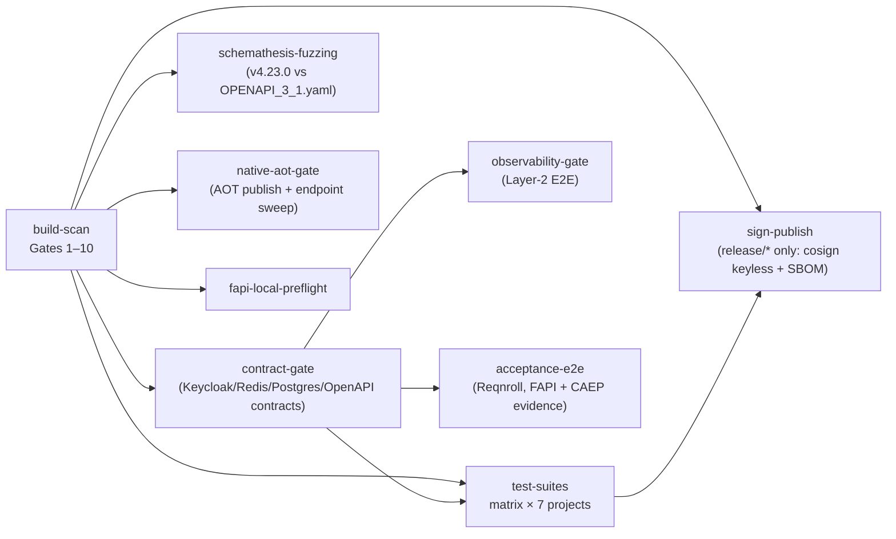

# 07 — Testing & Quality Assurance

> Sources: `tests/**`, `.github/workflows/security-pipeline.yml` (+ 8 sibling gate workflows), `stryker-config.json`, `docs/CODE_COVERAGE_GUIDE.md`, `Directory.Packages.props`. Test-count figures are as reported by the repository README; suite structure is verified from the tree and CI matrix.

## 1. Test Estate Overview

| Project | Kind | Focus (verified from files) |
|---|---|---|
| `Sentinel.Tests.Unit` | xUnit v3 unit | ~45 files: middleware behavior (`DpopValidationMiddlewareTests`, `DpopValidationMiddlewareSecurityTests`), crypto (`AesGcmEncryptionServiceTests`, `MlDsaSignatureVerifierTests`, `PrivacyPreservingHasherTests`, `SecurityContextHasherTests`), filters/stores (`IdempotencyFilter` via `RequireIdempotencyAttributeTests`, `InMemoryIdempotencyStoreTests`, `L1AntiFloodCacheTests`, `MtlsCertificateCacheTests`), Keycloak services, ACR pipeline (`AcrAuthorizationHandlerTests`, `AcrStepUpAuthorizationFilterTests`, `AcrValidationMiddlewareTests`, `StepUpAuthorizationResultHandlerTests`), resilience (`DpopStoreResilienceTests`, `DpopValidatorResilienceTests`, `FailFastResilienceTests`, `SsfEventProcessorResiliencyTests`), startup validation (`DpopStartupValidationTests`, `OpenIdConfigurationManagerRegistrationTests`), mTLS (`MtlsBindingMiddlewareTests`), TLS (`CaptchaTlsEnforcementTests`, `TlsEnforcement` coverage), telemetry (`DistributedTelemetryTests`, `SecurityEventEmitterTests`) |
| `Sentinel.Tests.DPoP` | xUnit unit | `DpopProofValidatorTests` (full check matrix), `DpopThumbprintComputerTests` (RFC 7638 vectors), helpers `TestJwtBuilder`, `FakeJtiReplayCache` |
| `Sentinel.Tests.Session` | xUnit unit | `SessionManagerTests`, `SessionContextTests` (fail-closed revocation) |
| `Sentinel.Tests.SSF` | xUnit unit | `SsfEventProcessorTests` + mocks (validator/revocation/blacklist) |
| `Sentinel.Tests.Concurrency` | xUnit + **Microsoft.Coyote** | `IdempotencyConcurrencyTests` — systematic concurrency proof; CI runs "Coyote Systematic Concurrency Proof (1000 iterations, IL-rewritten)" |
| `Sentinel.Tests.Integration` | xUnit + Testcontainers (Keycloak/PostgreSQL/Redis/Toxiproxy) | Auth flows, change-password, EF stores, hybrid blacklist, real-Keycloak flows, Redis provider, SD-JWT flows, security scenarios, SSF, TLS enforcement, Vault (provider + rotation), migration suites (`ComprehensiveMigrationTests`, `CrossVersionCompatibilityTests`, `MigrationChaosTests`, `MigrationResilienceTests`), crypto lifecycle (`JwksRotationIntegrationTests` + `RotatingJwksServer`), federation E2E (`RealParPkceDpopFlowTests` with Playwright, `TokenExchangeWithRealKeycloakTests`, `WebAuthnAal3CeremonyTests`, `WebAuthnBruteForceTests`, `WebAuthnMds3Tests`), observability contracts |
| `Sentinel.Tests.Security` | xUnit adversarial | Timing (`DpopTimingSideChannelTests`, `TimingAttackTests`), algorithm/downgrade (`AlgorithmResilienceTests`, `CompositeAuthDowngradeTests`), property-based FsCheck (`DpopAndRarPropertyTests`, `RarPropertyTests`, `PasswordStrengthPropertyTests`), fuzz-style protocol attacks (`ProtocolFuzzTests`), rate-limit bypass attempts, temporal boundary conditions, weak keys, chaos (`RedisResilienceTests`, `RedisResilienceChaosTests` with `ChaosSentinelApiFactory`), architecture rules (ArchUnitNET), AOT compatibility (`AotCompatibilityTests`), `TokenPoisoner` helper |
| `Sentinel.Contracts` | contract/schema | **OpenAPI**: endpoint availability, request/response schema compatibility, security schemes vs `Baselines/v1-baseline.json`; **Keycloak**: discovery document, JWKS key, token response, admin user, backchannel logout token — validated against JSON Schemas (`Schemas/*.schema.json`, JsonSchema.Net 9.4.0); **Postgres**: concurrency semantics, `ExecuteDelete` semantics, migration compatibility, unique constraints; **Redis**: JTI SET-NX semantics, nonce Lua script, TTL precision, key isolation, email-token store |
| `Sentinel.Tests.Acceptance` | **Reqnroll** BDD E2E | `FinanceTransfer.feature` (step-up challenge on acr2, in-bounds RAR transfer approved, out-of-bounds blocked 403 "Authorization Bounds Exceeded"), `SessionRevocation.feature`; self-managed Redis/Keycloak via Docker in CI |
| `Sentinel.FuzzTests` | **SharpFuzz** coverage-guided | Targets selectable at runtime (`dpop`, SD-JWT presenter path); seeds in `corpus/seed.txt`; driver `run-fuzzing.ps1` |
| `Sentinel.Benchmarks` | BenchmarkDotNet | `DpopValidatorBenchmark` ("DPoP Proof Cryptographic Validation"), `SdJwtPresenterBenchmark`, `PrivacyPreservingHasherBenchmark` |
| `Sentinel.Tests.Load` | adversarial host | `AdversarialTestHost` — the target for Schemathesis and Native AOT gates |
| `Sentinel.Tests.Shared` | fixtures | `SentinelApiFactory`, `RealKeycloakApiFactory`, `KeycloakDpopTokenClient`, `TestTokenIssuer`, `TestJwtBuilder`, `FakeTimeProvider`, cache adapters |
| `tests/load/**` | **k6 / xk6** | `sentinel-sre-core.js` (scenarios: spike → `SPIKE_MAX_RPS`, capacity ramp 2 000→12 000+ RPS in 2-min steps, soak `constant-arrival-rate`), `sentinel-sre-suite(-xk6).js`, `keycloak-token-load.js`, `chaos-load-test.js`, adversarial scripts under `Sentinel.LoadTests/k6-scripts/`; custom Go extension `xk6-dpop` (DPoP proof signing inside k6, with its own `dpop_test.go`); DPoP pool minting `mint-dpop-pool.mjs` + `test-pool.json` |
| `tests/chaos/**` | **LitmusChaos** | `redis-pod-kill.yaml` (PodChaos), `postgres-network-partition.yaml` (NetworkChaos), `dns-latency-keycloak.yaml` (DNSChaos), `cascade-failure.yaml` (Workflow composing PodChaos + NetworkChaos) |

README-reported totals: **496 tests / 8 suites** (Unit 290, Contracts 77, Security 63, Integration 46, DPoP 29, Session 22, SSF 7, Concurrency 3), 100% pass.

## 2. CI Pipeline — `security-pipeline.yml` ("Sentinel Core CI")



### 2.1 Gates inside `build-scan` (exact names from the workflow)

| Gate | Tool / command | Purpose |
|---|---|---|
| Gate 1 — Secret Scanning | `trufflesecurity/trufflehog@v3.95.9` | No credentials in history |
| Gate 2 — SAST | `semgrep/semgrep-action@v1` | Static analysis (repo carries targeted `nosemgrep` suppressions with justification comments, e.g. DPoP `ValidateLifetime=false`) |
| Gate 3 — NuGet Dependency Audit | `dotnet` restore audit | Vulnerable packages blocked (see SSH.NET CVE-2026-48798 pin) |
| Gate 4 — Build & Generate OpenAPI Contract | build `AdversarialTestHost`, run it, fetch live schema | Contract is generated from the running host, not hand-written |
| Gate 5 — OpenAPI Schema Drift Audit | `tests/infrastructure-openapi-audit.sh` (Node) | Diff vs committed baseline — breaking changes fail CI |
| Gate 6/7 — SBOM | `anchore/sbom-action@v0.17.9` → artifact `sentinel-sbom` (SPDX) | Supply-chain transparency; later attached to the image with cosign |
| Gate 8 — IaC Security Scan | `bridgecrewio/checkov-action` | Terraform/K8s/Dockerfile policy (repo `.dockerignore`/Dockerfile annotations align) |
| Gate 9 — Container Image Scan | `aquasecurity/trivy-action@v0.36.0` + SARIF upload (`.trivyignore` policy: entries require expiry + ticket, currently empty) | Image CVE gate |
| Gate 10 — Cryptographic Lifecycle & Rotation Tests | `dotnet test --filter "FullyQualifiedName~JwksRotation|KestrelCertificateHotReload|MtlsCertificateRotation|EnvelopeRewrap"` (Integration + Unit) | Key/cert rotation regressions are release-blocking |

### 2.2 Test matrix job (`test-suites`)

Matrix over: Unit, Integration, Security, DPoP, Session, SSF, Concurrency projects. Notable steps: locked-mode restore; `generate-certs.sh` for Testcontainers fixtures; pre-pull of Testcontainers images; Playwright Chromium install for browser-mediated FAPI 2.0 E2E; **Coyote systematic concurrency proof (1000 iterations, IL-rewritten)** after the Concurrency suite.

### 2.3 Specialized gates

- **schemathesis-fuzzing**: boots `AdversarialTestHost` on `:5000`, waits for `/healthz`, runs `schemathesis run docs/OPENAPI_3_1.yaml --phases coverage --checks not_a_server_error --workers 2`, uploads JUnit report.
- **native-aot-gate**: installs clang/zlib, runs `tests/scripts/validate-native-aot.sh linux-x64` (AOT publish + endpoint matrix sweep); host log uploaded on failure.
- **observability-gate**: `tests/scripts/validate-observability.sh` — full Layer-2 stack E2E proving metric/log/trace signal paths (uses the Prometheus rules in `infra/observability/prometheus/alerts.yml` as the assertion surface: `HighDPoPFailures`, `TokenReplayDetected` must fire end-to-end).
- **acceptance-e2e**: Reqnroll suite ("FAPI + CAEP Evidence").
- **sign-publish** (release branches): cosign keyless signing + SBOM attach + verification (see [06 §9](./06-DEPLOYMENT-AND-INFRASTRUCTURE.md)).

### 2.4 Sibling gate workflows

| Workflow | Scope |
|---|---|
| `contract-validation.yml` | Standalone contract-test enforcement |
| `migration-gate.yml` | EF Core migration compatibility (paired with `Database/*` integration suites) |
| `chaos-gate.yml` | LitmusChaos experiments (`tests/scripts/chaos-provision.sh`, kind cluster) + fail-closed validation (`tests/scripts/validate-fail-closed.sh`) |
| `sre-load-gate.yml` / `sre-distributed-gate.yml` | k6 SRE suites incl. distributed k6-operator runs (`apply-sre-crd.sh`, CRDs in `infra/k8s/sre/`, summary metric extraction `sre-summary-metric.mjs`, soak validation `validate-sre-soak.sh`) |
| `dast-release-gate.yml` | ZAP + Nuclei stack with gate evaluation (`infra/dast/scripts/evaluate-gates.sh`) |
| `fapi-conformance-gate.yml` | FAPI 2.0 conformance pre-flight (`run-fapi-conformance.sh`, `infra/fapi-conformance/`) |
| `pentest-gate.yml` | Pentest readiness verification (`infra/staging/verify-pentest-readiness.sh`) |

Local pipeline replay: `tests/scripts/run-pipeline-locally.ps1`.

## 3. Mutation Testing Gate (Stryker.NET)

`stryker-config.json`: target project `Sentinel.DPoP.csproj`, test-runner **MTP**, `mutation-level: Advanced`, coverage-analysis off, bail enabled, reporters dots/html/cleartext/markdown. **Thresholds: high 85 / low 70 / break 70** — a mutation score below 70 fails. Mutators exclude logging/trace/exception-ctor/`WipeKey`/diagnostics methods and non-logic files (`*Extensions.cs`, `*Options.cs`, `GlobalUsings.cs`, `*.g.cs`, `*JsonContext.cs`). Runbook (README): always execute from inside `tests/Sentinel.Tests.DPoP/` to avoid test-scope leaks:

```bash
dotnet tool restore
cd tests/Sentinel.Tests.DPoP/
dotnet stryker --config-file ../../stryker-config.json --project Sentinel.DPoP.csproj
```

## 4. Coverage Policy (as documented by the repository)

`docs/CODE_COVERAGE_GUIDE.md`: compliance targets **>80% global line coverage and >90% on critical paths** (NIST SP 800-53 / FAPI 2.0 Advanced / FedRAMP High framing), collected locally with coverlet (`coverlet.collector` 10.0.1) + ReportGenerator, excluding generated artifacts. The guide explicitly states coverage is **not currently enforced as a CI gate** (no `CollectCoverage`/`Threshold` steps in workflows) and marks CI gating as a roadmap item — reproduced here verbatim in spirit to avoid overclaiming.

## 5. Security-Test Methodology Highlights

- **Timing side channels**: `DpopTimingSideChannelTests` / `TimingAttackTests` statistically compare failure-path latencies (architecture doc records Welch's t-test with p > 0.05 acceptance); the mitigation under test is the 120 ms floor + 0–15 ms jitter ([03 §2.4](./03-SECURITY-AND-CRYPTOGRAPHY.md)).
- **Downgrade resistance**: `CompositeAuthDowngradeTests` + DAST nuclei templates assert DPoP-bound tokens cannot be replayed as Bearer, and proofs cannot be dropped.
- **Property-based**: FsCheck 3.3.3 properties over DPoP+RAR (`DpopAndRarPropertyTests`), RAR bounds (`RarPropertyTests`), password policy (`PasswordStrengthPropertyTests`).
- **Protocol fuzzing**: in-repo `ProtocolFuzzTests` (malformed JWT/DPoP/header structures), SharpFuzz harnesses for the DPoP validator and SD-JWT presenter, Schemathesis for HTTP-surface fuzzing.
- **Fail-closed chaos**: `RedisResilience*Tests` + Toxiproxy + LitmusChaos redis-pod-kill assert 503 (never pass-through) under store outage; `validate-fail-closed.sh` proves it at the container level.
- **Architecture fitness**: ArchUnitNET rules (`ArchitectureTests.cs`) enforce hexagonal dependency direction in CI.
- **AOT fitness**: `AotCompatibilityTests` + the native-aot gate ensure the reflection-free JSON discipline (`JsonSerializerIsReflectionEnabledByDefault=false`) holds.
- **Real-IdP E2E**: Playwright-driven PAR+PKCE+DPoP browser flows against real Keycloak (`RealParPkceDpopFlowTests`), WebAuthn AAL3 ceremonies (`WebAuthnAal3CeremonyTests`, `WebAuthnBruteForceTests`, `WebAuthnMds3Tests`), token exchange against real Keycloak.

## 6. Load & SRE Engineering

- **Scripts**: `sentinel-sre-core.js` defines three executors — spike (`ramping-arrival-rate` to `SPIKE_MAX_RPS`), capacity ramp (2 000 → 12 000+ RPS in 2-minute steps to `CAPACITY_MAX_RPS`), and soak (`constant-arrival-rate` at `SOAK_RPS` for `SOAK_DURATION`); per-replica rate division for distributed k6-operator runs; trend metrics such as `sentinel_dpop_gen_duration_ms`; threshold example `'latency < 100ms'`.
- **DPoP at load**: the custom `xk6-dpop` Go extension signs valid proofs inside k6 (`tests/load/xk6-dpop/dpop.go` + tests); pool pre-minting via `mint-dpop-pool.mjs` against Keycloak (`test-pool.json`).
- **CRDs**: `infra/k8s/sre/crd-capacity.yaml`, `crd-soak-48h.yaml`, `crd-spike-20k.yaml` (k6-operator distributed tests); applied by `apply-sre-crd.sh`; results summarized by `sre-summary-metric.mjs`; soak gate `validate-sre-soak.sh`.
- **Adversarial**: `Sentinel.LoadTests/k6-scripts/adversarial-stress-test.js`, `load-test-adversarial.js` (abuse-pattern traffic against the `AdversarialTestHost`).
- **Runbooks**: `docs/SRE_LOAD_TESTING_RUNBOOK.md`, `docs/DISTRIBUTED_CONCURRENCY_SPEC.md`.

## 7. DAST Program (black-box)

Stack and templates described in [06 §7](./06-DEPLOYMENT-AND-INFRASTRUCTURE.md). Gate semantics: `evaluate-gates.sh` aggregates ZAP alerts (after `alert-filters.json` triage) and Nuclei findings into a release verdict consumed by `dast-release-gate.yml`. The DPoP auth-proxy + ZAP script ensure the scanner presents *valid* sender-constrained requests, so 401s in the report indicate real defects rather than protocol incapability. Program docs: `docs/DAST_AND_PENTEST_PROGRAM.md`, `docs/PENTEST_PROGRAM.md`, RoE `docs/PENTEST_ROE_SENTINEL.md`.

## 8. Quality Toolchain Summary

| Dimension | Tooling (pinned) |
|---|---|
| Unit/integration framework | xUnit v3 3.2.2, Microsoft.NET.Test.Sdk 18.8.1, FluentAssertions 8.10.0, Moq 4.20.72 |
| Containers in tests | Testcontainers 4.13.0 (Keycloak, PostgreSql, Redis, Toxiproxy) |
| Time control | `Microsoft.Extensions.TimeProvider.Testing` 10.8.0, in-repo `FakeTimeProvider` |
| BDD | Reqnroll 3.3.4 |
| Property-based | FsCheck 3.3.3 |
| Concurrency proof | Microsoft.Coyote 1.7.11 (1000-iteration CI run) |
| Fuzzing | SharpFuzz 2.3.0; Schemathesis 4.23.0 |
| Mutation | Stryker.NET (Advanced level; break 70 / low 70 / high 85) |
| Benchmarks | BenchmarkDotNet 0.15.8 |
| Architecture | TngTech.ArchUnitNET 0.13.3 |
| Browser E2E | Microsoft.Playwright 1.52.0 |
| Coverage | coverlet.collector 10.0.1 + ReportGenerator (local; CI gate is roadmap per coverage guide) |
| Load | k6 + xk6 (custom DPoP extension), k6-operator CRDs |
| Chaos | LitmusChaos (PodChaos/NetworkChaos/DNSChaos/Workflow), Toxiproxy |
| DAST | OWASP ZAP (automation plan + policies), Nuclei (10 templates) |
| Supply chain | TruffleHog, Semgrep, Trivy (+SARIF), Checkov, Anchore SBOM (SPDX), cosign keyless signing, locked-mode restores |
