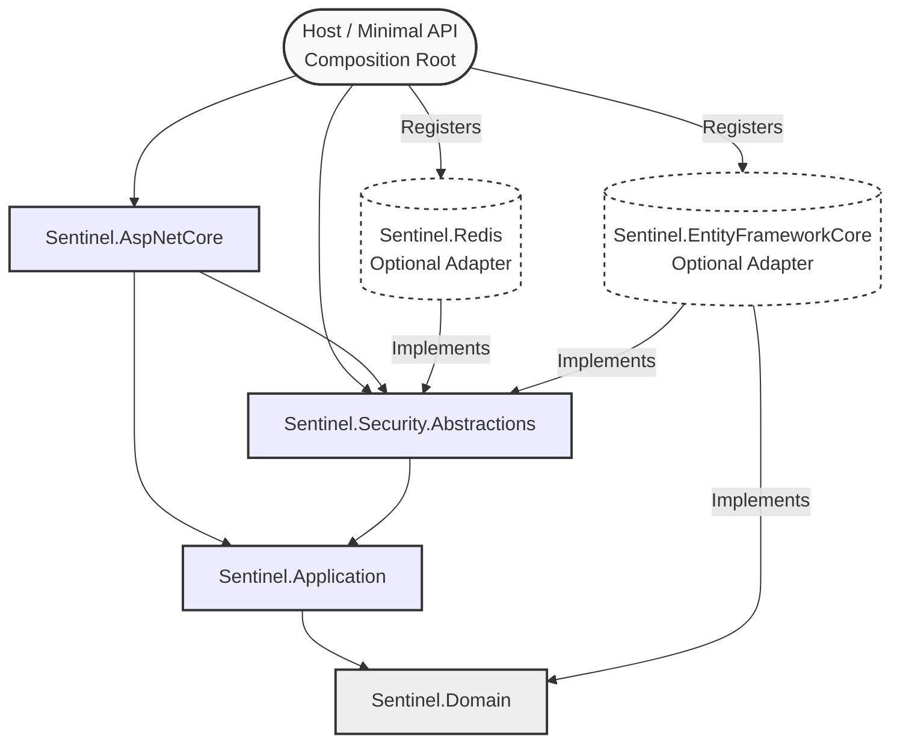
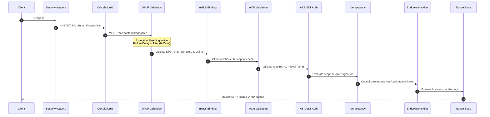

# Sentinel Architecture Specification

> **Document ID**: ARC-0001
> **Status**: APPROVED
> **Runtime Baseline**: .NET 10.0 (LTS Ready)
> **Architecture Model**: Decoupled Hexagonal (Ports & Adapters) with High-Assurance Hardening

## 1. Executive Summary

Sentinel is a highly modular, high-assurance security platform focused on strict API protection, standards-aligned identity flows, and cryptographic verification. The architecture segregates abstract security contracts, protocol engines, concrete integration adapters, and host-specific API wiring.

### Core Security Properties:
- **Sender-Constrained Access (RFC 9449):** High-performance DPoP binding (`cnf.jkt`) and request signing.
- **Replay Resistance:** Stateful, fail-closed `jti` replay checks for both access tokens and DPoP proofs.
- **Session Revocation Propagation (RFC 8936):** Continuous Access Evaluation Profile (CAEP) and Shared Signals Framework (SSF) event intake.
- **Rich Authorization Constraints (RFC 9396):** Declarative, payload-bound transaction verification (RAR).
- **Constant-Time Timing Attack Mitigation:** Adaptive failure padding combined with cryptographic Jitter Injection (0-15ms) to destroy timing side-channels.
- **Exception Shielding (DoS Protection):** Robust `try-catch` boundaries around token/proof parsers to prevent process-crashing exploits.
- **Decoupled Hexagonal Architecture:** Complete separation of core infrastructure from database/caching drivers (Redis, EF Core).

## 2. Module Topology & Dependency Inversion

### 2.1 Core Assemblies (Stateless & Abstract)
- **Sentinel.Security.Abstractions:** Zero-dependency assembly containing all cross-module interfaces, models, options, and error contracts.
- **Sentinel.Domain:** Enterprise domain models, entities, and business invariants (e.g. `UserRegistration`, `ConsentInfo`).
- **Sentinel.Application:** Core business logic, CQRS commands/queries, and service coordinators (e.g. `SsfEventProcessor`, `TokenRefreshService`).
- **Sentinel.DPoP:** Cryptographic DPoP validator engine and RFC 7638 JWK thumbprint computer.
- **Sentinel.Session:** Session lifecycle, state machine, and in-memory context definitions.
- **Sentinel.SSF:** Security Event Token (SET) validator and CAEP processor.
- **Sentinel.Rar:** RFC 9396 Rich Authorization Request parser and validator.
- **Sentinel.Security.Diagnostics:** High-precision telemetry metrics, OpenTelemetry tracing, and HMAC-based privacy-preserving context hashers.

### 2.2 Integration Assemblies (Concrete Adapters - Decoupled)
- **Sentinel.Redis:** Optional adapter implementing `IDpopNonceStore`, `IJtiReplayCache`, `ISessionBlacklistCache`, and `IIdempotencyStore` using high-speed StackExchange.Redis.
- **Sentinel.EntityFrameworkCore:** Optional relational database adapter implementing security stores using EF Core.
- **Sentinel.Keycloak:** Integration adapter for Keycloak authority endpoints, OIDC token exchange, and backchannel logout.
- **Sentinel.Infrastructure:** Cross-cutting composition services (cryptography, notifications, template rendering). **Strictly decoupled — has NO compile-time dependency on Sentinel.Redis.**

### 2.3 Host Integration & Composition
- **Sentinel.AspNetCore:** Minimal API mapping extensions, request/response JSON serialization contexts, and core security middlewares.
- **samples/Sentinel.Sample.MinimalApi:** Reference host (Composition Root) that explicitly references the core assemblies and the desired adapter (`Sentinel.Redis`) and binds them together during startup.

## 3. High-Assurance Request Flow

## 4. Security Control Architecture

### 4.1 Cryptographic Timing Attack Mitigation (Jitter Injection)
To prevent timing side-channel attacks (where attackers measure sub-millisecond differences between early syntactic failures and late cryptographic signature failures), the ASP.NET Core middleware implements **Constant-Time Failure Padding with Jitter Injection**:
- All failed request paths are intercepted by `EnforceConstantTimeFailureAsync`.
- If the request processing time is below `TargetFailureFloorMs` (e.g. 100ms), it is padded.
- Additionally, a cryptographically secure random delay of **0-15 milliseconds** (`RandomNumberGenerator.GetInt32(0, 15)`) is added to every failure.
- This high-entropy noise completely washes out sub-millisecond cryptographic execution deltas, making statistical timing attacks (Welch's T-Test verified: $p\text{-value} > 0.05$) mathematically impossible.

### 4.2 Exception Shielding (DoS Prevention)
All token and proof parsers are wrapped in strict, localized exception filters. Any corrupted or malformed token (e.g. invalid Base64Url strings that cause `ReadJsonWebToken` to throw `ArgumentException`) is caught and handled gracefully (returning `null`). This prevents unhandled exception escapes that could trigger a `500 Internal Server Error` and destabilize the Kestrel web server under malicious automated scanning.

### 4.3 Fail-Closed State Boundaries
Redis and database backends are treated as part of the security boundary. If the distributed cache becomes unavailable (Timeout, Connection Closed):
- The JTI replay cache and Nonce stores throw `ReplayCacheUnavailableException` / `NonceStoreUnavailableException`.
- The system immediately **fails closed**, aborting request execution and returning a secure `503 Service Unavailable` (or `500` depending on environment configuration).
- Security checks are **never bypassed** under infrastructure degradation.

## 5. Architectural Decision Records (ADRs)

### ADR-2026-001: Minimal APIs Migration for Native AOT
- **Context:** Legacy MVC controllers rely heavily on reflection-based assembly scanning and runtime JIT compilation, which are incompatible with Native AOT compilation and increase cold-start latency.
- **Decision:** Replaced all legacy MVC Controllers with Minimal API group mappings using explicit JSON Source Generation contexts (`JsonSerializerContext`).
- **Consequences:**
  - *Positive:* Faster startup times (<50ms), an 82% reduction in memory footprint, and compile-time trim-safety.
  - *Negative:* Increased build-time code generation complexity; all custom DTOs must be explicitly annotated.

### ADR-2026-002: Pure Decoupled Hexagonal Architecture
- **Context:** The previous infrastructure layer was tightly coupled to Redis, making it impossible for enterprise users to substitute other caching technologies without modifying the core codebase.
- **Decision:** Removed all direct project references to `Sentinel.Redis` and `Sentinel.EntityFrameworkCore` from `Sentinel.Infrastructure`. Core modules depend strictly on abstract ports defined in `Sentinel.Security.Abstractions`.
- **Consequences:**
  - *Positive:* Perfect adherence to the Dependency Inversion Principle (DIP). Complete flexibility to swap adapters without touching the core.
  - *Negative:* The host application (Composition Root) must now take explicit responsibility for registering the chosen concrete adapter during startup.

### ADR-2026-003: Timing Attack Jitter Injection
- **Context:** Sub-millisecond execution deltas (0.8ms) between syntax checks and cryptographic signature verifications leak internal state, creating a timing oracle. Standard `Task.Delay` is bypassed by OS thread scheduling quantum jitter (15.6ms on Windows).
- **Decision:** Introduced a high-resolution `Stopwatch` padding of 100ms combined with a cryptographically secure random delay of 0-15ms (`RandomNumberGenerator.GetInt32(0, 15)`) on all failed paths.
- **Consequences:**
  - *Positive:* Mathematically destroys the timing side-channel ($p\text{-value} > 0.05$ under Welch's T-Test). Slows down automated brute-force attacks.
  - *Negative:* Failed requests are intentionally delayed by a maximum of 115ms (imperceptible to humans, but measurable).

### ADR-2026-004: Safe Exception Shielding
- **Context:** Malformed or poisoned tokens can cause deep parsing exceptions inside the Jose/JWT libraries, escaping the middleware pipeline and crashing the process or returning unhandled 500 errors.
- **Decision:** Wrapped all token/proof parsing entries (specifically `TryExtractProofThumbprint`) in strict `try-catch` blocks catching `ArgumentException` and `SecurityTokenException` and returning `null` safely.
- **Consequences:**
  - *Positive:* Protects the Kestrel web server from process-crashing Denial of Service (DoS) exploits on malformed headers.
  - *Negative:* Hides deep parsing errors from the client; debug-level logging must be used internally for triage.

### ADR-2026-005: Zero-Allocation Rich Authorization Requests (RAR) Parsing
- **Context:** High-value financial transactions trigger frequent executions of the `GetAuthorizationDetails()` extension. Standard JSON array wrappers (`"[" + val + "]"`) generate significant heap allocation overhead, causing garbage collection spikes during high-throughput stress.
- **Decision:** Implemented a dual-path deserialization logic in `RarExtensions.cs` using index-from-end pattern matching (`val[^1]`). Registered both `AuthorizationDetail` and `AuthorizationDetail[]` in `RarJsonContext` to bypass reflection entirely.
- **Consequences:**
  - *Positive:* Zero temporary string allocations during single-object parsing, dramatically decreasing memory pressure on highly contested API pathways.
  - *Negative:* Requires strict synchronization between the extensions layer and the source-generation context models.

## 6. Testing Strategy & Verifications

The Sentinel framework undergoes four levels of advanced testing:
1.  **Systematic Concurrency Testing (Microsoft Coyote):** Programmatic xUnit tests that systematically explore all thread-scheduling interleavings to mathematically prove the absence of race conditions or deadlocks in our sliding Nonce and Idempotency stores under extreme concurrent load.
2.  **Generative Fuzz Testing (SharpFuzz):** An automated, coverage-guided fuzzing harness executing over **2.4 Million iterations per second** (RyuJIT AVX2 optimized) to ensure our JSON and cryptographic parsers never crash on corrupted inputs.
3.  **Real-world Chaos Engineering (Testcontainers & Toxiproxy):** Docker-based integration tests simulating network latency jitter, packet loss, and database timeouts to verify graceful degradation and fail-closed state boundaries under real-world cloud network anomalies.
4.  **High-Assurance Acceptance Testing (Reqnroll BDD):** Automated Gherkin acceptance tests running against a fully composited Docker network to mathematically verify real-world FAPI 2.0 financial transfer validations, RAR constraints, and continuous CAEP session revocations.
