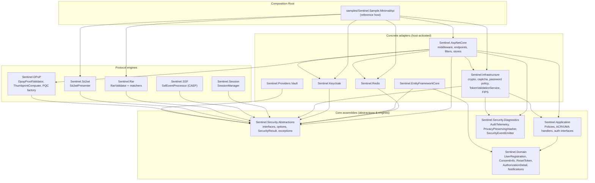

# 01 — System Overview

> Traceability: all facts in this document cite repository-relative paths. Module inventory verified against `Sentinel.slnx`; package versions against `Directory.Packages.props`; runtime against `global.json` and `Directory.Build.props`.

## 1. Product Definition

**Sentinel** is a security-focused ASP.NET Core Web API framework that enforces *sender-constrained* token validation, aligned with **FAPI 2.0 Baseline and Advanced** hardening goals (`README.md`). It is delivered as a set of packable NuGet modules (package IDs `NikaNats.Sentinel.*`, e.g. `NikaNats.Sentinel.AspNetCore` in `src/Sentinel.AspNetCore/Sentinel.AspNetCore.csproj`) plus a reference Minimal-API host (`samples/Sentinel.Sample.MinimalApi`) that acts as the composition root.

The capabilities enumerated by the repository `README.md` and confirmed in source:

| Capability | Implementing component(s) |
|---|---|
| DPoP access-token handling with proof validation and nonce issuance | `src/Sentinel.DPoP/DpopProofValidator.cs`, `src/Sentinel.AspNetCore/Middleware/DpopValidationMiddleware.cs`, `src/Sentinel.Redis/Stores/RedisDpopNonceStore.cs` |
| Redis-backed replay detection for access-token `jti` and DPoP proof `jti` | `src/Sentinel.Redis/Stores/RedisJtiReplayCache.cs`, `src/Sentinel.Infrastructure/Auth/TokenValidationService.cs` |
| ACR- and scope-based authorization requirements | `src/Sentinel.Application/Auth/Handlers/AcrAuthorizationHandler.cs`, `src/Sentinel.Application/Auth/Models/ScopeRequirement.cs`, `src/Sentinel.AspNetCore/Filters/AcrStepUpAuthorizationFilter.cs` |
| mTLS certificate binding for `cnf.x5t#S256`-bound tokens | `src/Sentinel.AspNetCore/Middleware/MtlsBindingMiddleware.cs` |
| Strict JWT algorithm constraints and zero clock-skew lifetime validation | `samples/Sentinel.Sample.MinimalApi/Program.cs` (`ValidAlgorithms = ["PS256","ES256"]`, `ClockSkew = TimeSpan.Zero` in non-Development) |
| Security telemetry, headers, rate limiting, structured errors | `src/Sentinel.Security.Diagnostics/AuthTelemetry.cs`, `src/Sentinel.AspNetCore/Middleware/SecurityHeadersMiddleware.cs`, sample-host `AddRateLimiter`, `src/Sentinel.AspNetCore/Errors/ErrorCodes.cs` |
| Post-quantum signature verification (ML-DSA / FIPS 204) | `src/Sentinel.Infrastructure/Cryptography/MlDsaSignatureVerifier.cs`, `src/Sentinel.DPoP/Pqc/*` |
| SSF/CAEP security-event intake | `src/Sentinel.SSF/SsfEventProcessor.cs`, `src/Sentinel.AspNetCore/Endpoints/SsfEndpoints.cs` |
| SD-JWT selective disclosure verification | `src/Sentinel.SdJwt/SdJwtPresenter.cs` |
| RFC 9396 Rich Authorization Requests (RAR) | `src/Sentinel.Rar/*` |
| OIDC Backchannel Logout | `src/Sentinel.AspNetCore/Endpoints/BackchannelLogoutEndpoints.cs` |
| Keycloak integration (admin API, token exchange, refresh, UMA, federation) | `src/Sentinel.Keycloak/*` |
| Envelope encryption with key-ring rotation | `src/Sentinel.Infrastructure/Cryptography/AesGcmEncryptionService.cs` |
| Vault-backed secret retrieval (K8s workload identity) | `src/Sentinel.Providers.Vault/VaultSecretProvider.cs` |

Explicitly **out of scope** per the README implementation-status table: full OAuth PAR/PKCE orchestration endpoints are "Planned/Externalized" — Keycloak drives flow orchestration; Sentinel consumes and enforces the resulting tokens.

## 2. Solution Topology

Verified from `Sentinel.slnx`. Dependency direction (project references in `.csproj` files) implements a decoupled hexagonal architecture (`docs/ARCHITECTURE.md`, §2):

*(`Sentinel.AspNetCore` project references verified in `src/Sentinel.AspNetCore/Sentinel.AspNetCore.csproj`: Application, DPoP, Infrastructure, Keycloak, Redis, Security.Abstractions, Security.Diagnostics.)*

### 2.1 Module Inventory (src/)

| Project | Role | Key types (verified in source) |
|---|---|---|
| `Sentinel.Security.Abstractions` | Ports: every cross-module contract | `IDpopProofValidator`, `IDpopNonceStore`, `IJtiReplayCache`, `ISessionBlacklistCache`, `IIdempotencyStore`, `ISsfEventProcessor`, `ISdJwtVerifier`, `ISecretProvider`, `SecurityResult<T>` + ROP extensions, `SecurityErrors`, options (`DPoPOptions`, `AcrRankingOptions`, `SessionBlacklistOptions`, `SsfOptions`, `SdJwtOptions`), fail-closed exception hierarchy (`SecurityInfrastructureException` → `ReplayCacheUnavailableException`, `NonceStoreUnavailableException`, `SessionBlacklistUnavailableException`, `IdempotencyStoreUnavailableException`), `MlDsaSecurityKey` |
| `Sentinel.Domain` | Enterprise domain models | `UserRegistration`, `ConsentInfo`, `ResetToken`, `AuthorizationDetail` (RAR), `NotificationMessage`/`Recipient`/`Type` |
| `Sentinel.Application` | Business logic & authorization handlers | `Policies`, `AcrAuthorizationHandler`, `UmaResourceAuthorizationHandler`, `ScopeRequirement`, `AcrRequirement`, `RarExtensions.GetAuthorizationDetails`, password-policy/captcha options, auth interfaces (`ITokenRefreshService`, `ITokenExchangeService`, `IAuthRevocationService`, …) |
| `Sentinel.DPoP` | RFC 9449 proof-validation engine | `DpopProofValidator`, `DpopThumbprintComputer` (RFC 7638), `Pqc/MlDsaSignatureProvider`, `Pqc/PqcCryptoProviderFactory`, `DpopJsonContext` (STJ source-gen) |
| `Sentinel.AspNetCore` | HTTP layer: middleware, endpoints, filters | `DpopValidationMiddleware`, `MtlsBindingMiddleware`, `SecurityHeadersMiddleware`, `AcrValidationMiddleware`, `CorrelationIdMiddleware`, `StepUpAuthorizationResultHandler`, `IdempotencyFilter`, `AcrStepUpAuthorizationFilter`, `AuthEndpoints`, `SsfEndpoints`, `TokenExchangeEndpoints`, `BackchannelLogoutEndpoints`, `L1AntiFloodCache`, `InMemoryIdempotencyStore`, `MtlsCertificateCache`, `KestrelCertificateReloader`, `SecurityInvariantsStartupFilter`, `ErrorCodes` |
| `Sentinel.Infrastructure` | Cross-cutting services | `TokenValidationService`, `AesGcmEncryptionService`, `CryptographyOptions`, `MlDsaSignatureVerifier`, `PrivacyKeyManager`, `FipsConfiguration`, `EnterprisePasswordStrengthValidator`, `CloudflareTurnstileCaptchaService`, `LogoutTokenValidator`, `LoggingEmailService`, `SentinelDbContext` (+ migrations `20260720210244_InitialDomainDb`) |
| `Sentinel.Keycloak` | Keycloak adapter | `KeycloakAdminTokenProvider`, `KeycloakAuthRevocationService`, `KeycloakTokenExchangeService`, `KeycloakTokenRefreshService`, `KeycloakUmaPermissionService`, `KeycloakFederationService`, `KeycloakUserService`, `KeycloakProfileService`, `KeycloakConfigurationManager`, `SocialFederationConfiguratorHostedService`, `Dpop/KeycloakDpopProofFactory`, `Dpop/DpopProofDelegatingHandler`, `Handlers/KeycloakAdminCircuitBreakerHandler` |
| `Sentinel.Redis` | Distributed security stores (production adapter) | `RedisConnectionProvider` (hardened `CommandMap`), `RedisJtiReplayCache`, `RedisDpopNonceStore` (Lua compare-and-delete), `RedisSessionBlacklistCache`, `RedisIdempotencyStore`, `EmailVerificationTokenStore`, `RedisOptionsValidator` |
| `Sentinel.EntityFrameworkCore` | Relational adapter (PostgreSQL) | `SentinelSecurityDbContext` (+ migration `20260726212544_InitialSecurityDb`), `EfDpopNonceStore`, `EfJtiReplayCache`, `EfSessionBlacklistCache`, `HybridSessionBlacklistCache` (L1/L2/L3), `SecurityCacheCleanupService` (15-min BackgroundService) |
| `Sentinel.Session` | Session lifecycle | `SessionManager` (fail-closed `revocation_unavailable`), `SessionContext`, `SessionManagementOptions` + startup validator |
| `Sentinel.SSF` | RFC 8936 / CAEP event processing | `SsfEventProcessor`, `SsfProcessingOptions`, `SsfJsonContext` |
| `Sentinel.Rar` | RFC 9396 RAR validation | `RarValidator` (polymorphic matcher routing), `FinancialAuthorizationMatcher`, `RarExtractor`, `RarValidationOptions` |
| `Sentinel.SdJwt` | SD-JWT (RFC 9901 per source annotation) | `SdJwtPresenter`, `SdJwtVerificationOptions`, `SdJwtVerificationResult` |
| `Sentinel.Security.Diagnostics` | Telemetry & privacy | `AuthTelemetry` (meter `Sentinel.Auth.Metrics`, source `Sentinel.Auth.Tracing`), `SecurityEventEmitter`, `PrivacyPreservingHasher` (daily-keyed HMAC-SHA256), `SecurityContextHasher` |
| `Sentinel.Providers.Vault` | HashiCorp Vault KV v2 provider | `VaultSecretProvider` (K8s ServiceAccount JWT login, 50-min token cache) |

### 2.2 Reference Host (composition root)

`samples/Sentinel.Sample.MinimalApi/Program.cs` is the canonical wiring example and the artifact containerized by `src/Sentinel.AspNetCore/Dockerfile` (`ENTRYPOINT ["dotnet", "Sentinel.Sample.MinimalApi.dll"]`). `src/Sentinel.AspNetCore/Program.cs` is an intentional stub — its header comment states it "exists solely to support test infrastructure and WebApplicationFactory" and is "not used in production scenarios".

The host composes: Kestrel hardening → OpenTelemetry (metrics/tracing/logs) → CORS → ForwardedHeaders → JWT Bearer authentication (Keycloak authority) → Sentinel module registrations (`AddRedisSecurityCaches`, `AddApplicationLayer`, `AddSsfProcessing`, `AddRarValidation`, `AddKeycloakIntegration`, `AddInfrastructureLayer`) → authorization policies (`ScopeProfile`, `ScopeDocumentsRead`, `ScopeDocumentsWrite`) → dual-partition global rate limiter → `AddSentinelAspNetCore().AddAll().ConfigureAcrRanking()` → middleware pipeline → endpoints (`/`, `/healthz`, `MapSentinelSecurity("v1")`, documents, finance, showcase) → `MapOpenApi()`, `MapPrometheusScrapingEndpoint()`, `MapScalarApiReference("/docs")`.

## 3. Technology Stack (pinned versions)

From `Directory.Packages.props` (Central Package Management, `ManagePackageVersionsCentrally=true`, `CentralPackageTransitivePinningEnabled=true`), `global.json`, `docker-compose.yml`, `src/Sentinel.AspNetCore/Dockerfile`:

| Component | Pinned version | Evidence |
|---|---|---|
| .NET SDK | 10.0.302 (`rollForward: disable`) | `global.json` |
| Target framework | `net10.0` (all projects) | `Directory.Build.props` |
| ASP.NET Core platform packages | 10.0.10 (`Microsoft.AspNetCore.Authentication.JwtBearer`, `.Certificate`, `Microsoft.AspNetCore.OpenApi`, `Mvc.Testing`) | `Directory.Packages.props` |
| Microsoft.IdentityModel.* | 8.19.2 (`Tokens`, `JsonWebTokens`, `Protocols`, `Protocols.OpenIdConnect`, `System.IdentityModel.Tokens.Jwt`) | `Directory.Packages.props` |
| EF Core + Npgsql | 10.0.10 / Npgsql 10.0.3 (`Npgsql.EntityFrameworkCore.PostgreSQL`) | `Directory.Packages.props` |
| StackExchange.Redis | 3.0.17 | `Directory.Packages.props` |
| OpenTelemetry | 1.17.0 exporters/instrumentation; Prometheus exporter 1.13.1-beta.1 | `Directory.Packages.props` |
| Scalar API reference UI | 2.16.15 | `Directory.Packages.props` |
| Keycloak (container) | `quay.io/keycloak/keycloak:26.6.4` | `docker-compose.yml` |
| Redis (container) | `redis:7.4-alpine`, started with `--save "" --appendonly no` | `docker-compose.yml` |
| PostgreSQL (container) | `postgres:17-alpine` | `docker-compose.yml` |
| Runtime base image | `mcr.microsoft.com/dotnet/aspnet:10.0.11-noble-chiseled` | `src/Sentinel.AspNetCore/Dockerfile` |
| Build base image | `mcr.microsoft.com/dotnet/sdk:10.0.302-noble` | `src/Sentinel.AspNetCore/Dockerfile` |
| xUnit | `xunit.v3` 3.2.2 | `Directory.Packages.props` |
| Testcontainers | 4.13.0 (Keycloak, PostgreSql, Redis, Toxiproxy) | `Directory.Packages.props` |
| Property-based testing | FsCheck 3.3.3 | `Directory.Packages.props` |
| Systematic concurrency testing | Microsoft.Coyote 1.7.11 / CLI 1.7.9 | `Directory.Packages.props` |
| Fuzzing | SharpFuzz 2.3.0 (+ CommandLine 2.2.0) | `Directory.Packages.props` |
| BDD | Reqnroll 3.3.4 (+ Reqnroll.xUnit) | `Directory.Packages.props` |
| Browser E2E | Microsoft.Playwright 1.52.0 | `Directory.Packages.props` |
| Benchmarks | BenchmarkDotNet 0.15.8 | `Directory.Packages.props` |
| Architecture tests | TngTech.ArchUnitNET 0.13.3 | `Directory.Packages.props` |
| Versioning | Nerdbank.GitVersioning 3.10.91, base `1.0.0` | `Directory.Packages.props`, `version.json` |
| Analyzers | `AnalysisMode=All`; SecurityCodeScan.VS2019 5.6.7; Microsoft.VisualStudio.Threading.Analyzers 17.14.15 | `Directory.Build.props`, `Directory.Packages.props` |

Supply-chain note recorded in `Directory.Packages.props`: `SSH.NET` is transitively force-pinned to `2026.0.0` because Testcontainers 4.13 pulls `SSH.NET 2025.1.0`, "which is vulnerable (CVE-2026-48798, SCP path traversal)".

NuGet is locked to a single feed with source mapping (`nuget.config`: `<clear/>` + `nuget.org` only, `packageSourceMapping` `*` → nuget.org, `signatureValidationMode: accept`, 120 s HTTP timeout).

## 4. Build & Packaging Model

From `Directory.Build.props`:

- **Framework/language**: `net10.0`, `Nullable=enable`, `ImplicitUsings=enable`, `InvariantGlobalization=true`, `TrimMode=link`.
- **Analysis**: `AnalysisMode=All`; `TreatWarningsAsErrors=true` when `CI=true` or `Configuration=Release` (zero-warning policy in CI, per README "Build Configuration").
- **AOT discipline**: `JsonSerializerIsReflectionEnabledByDefault=false` — System.Text.Json *throws* instead of silently falling back to reflection, making `dotnet test` behave like Native AOT for serialization. AOT/trim analyzers are deliberately **not** enabled repo-wide (comment: EF Core, ConfigurationBinder, minimal-API routing are JIT-only paths); `PublishAot` is opt-in per module. A dedicated CI job (`native-aot-gate`) publishes the adversarial test host with Native AOT and sweeps the endpoint matrix via `tests/scripts/validate-native-aot.sh`.
- **Reproducibility**: `ContinuousIntegrationBuild=true` under CI/GitHub Actions; `RestorePackagesWithLockFile=true` (lock files committed; CI restores with `--locked-mode` — see `.github/workflows/security-pipeline.yml`).
- **Strong-name signing (hybrid model)**: signing activates only when `SignSentinelRelease=true` *and* a key file exists; `Sentinel.snk` (private, CI secret `SENTINEL_SNK_BASE64`) preferred, else `PublicSign=true` against committed `Sentinel.public.snk`; `DelaySign=false`. Release packaging: `dotnet pack Sentinel.slnx -c Release -p:SignSentinelRelease=true -o ./artifacts` (README).
- **InternalsVisibleTo**: granted to `Sentinel.Tests.Concurrency`, `Sentinel.Tests`, `Sentinel.Benchmarks`, `Sentinel.FuzzTests`, and the `Sentinel.Tests.{Unit,Integration,Security,DPoP,Session,SSF}` projects.
- **Packaging metadata**: Apache-2.0 (`PackageLicenseExpression`), repository `https://github.com/NikaNats/Sentinel`, symbols as `snupkg`, `EmbedUntrackedSources=true`, `PublishRepositoryUrl=true`.

## 5. Delivery Artifacts & Spec Provenance

- Specification: `.specify/specs/SPEC-0001-auth-token-issuance.md`; plan `.specify/plans/PLAN-0001-auth-implementation.md`; tasks `.specify/tasks/TASK-0001-auth-implementation.md`; governance constitution `.specify/memory/constitution.md`.
- Machine-readable API contract: `docs/OPENAPI_3_1.yaml` (`info.version: 2026-08-20`, title "Sentinel API Contract (Framework + Reference Host)"), with a committed baseline `tests/Sentinel.Contracts/OpenApi/Baselines/v1-baseline.json` and a generator `scripts/generate_openapi_baseline.py`.
- Container: built from `src/Sentinel.AspNetCore/Dockerfile`; release images pushed to `ghcr.io/${{ github.repository }}/sentinel-api`, tagged by commit SHA, signed keyless with cosign and SBOM-attached (`sign-publish` job in `.github/workflows/security-pipeline.yml`).
- Helm chart: `infra/helm/sentinel` (default image repository `ghcr.io/nikanats/sentinel-api`).

## 6. Implementation Status (as reported by the repository)

Per the README "Implementation Status" table: API host & middleware pipeline, JWT validation & policy authorization, DPoP proof validation, replay protection, DPoP nonce management, mTLS token binding, rate limiting, idempotency enforcement, session management, OpenTelemetry/metrics, and testing are all **Implemented**; full OAuth PAR/PKCE orchestration endpoint set is **Planned/Externalized** (Keycloak-driven). The same table reports **496 tests across 8 suites** (Unit 290, Contracts 77, Security 63, Integration 46, DPoP 29, Session 22, SSF 7, Concurrency 3) at 100% pass rate.
